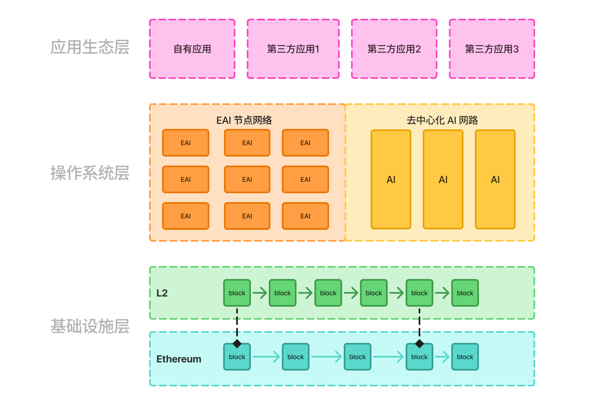
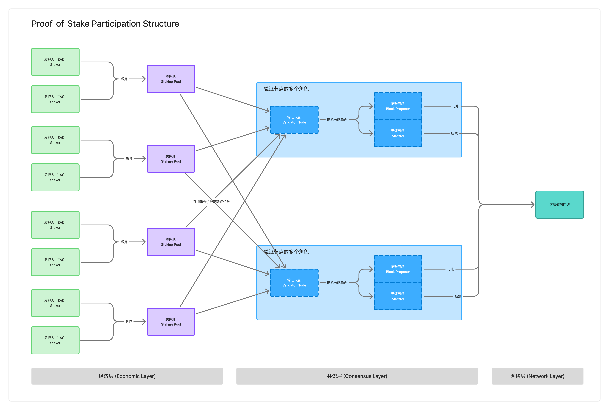
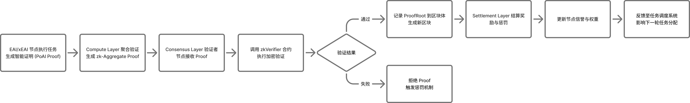

# AIXC White Paper v3.0

## Economy of Decentralized Intelligent Asset Infrastructure
## 去中心化智能资产经济基础设施

---

**Abstract**

AIXC introduces **EDIAN** (Economy of Decentralized Intelligent Asset Infrastructure) - a protocol architecture that enables intelligent assets to participate autonomously in economic systems.

The EDIAN architecture addresses a fundamental gap: while Embodied AI (EAI) devices can now perform complex physical tasks, they lack the infrastructure to prove their work, quantify their value, and transact without intermediaries. AIXC provides this infrastructure through three core innovations: (1) **EAI/xEAI dual-intelligence architecture** that bridges physical execution and on-chain coordination, (2) **Proof of AI (PoAI) consensus** that verifies and rewards intelligent contributions through cryptographic proofs, and (3) **decentralized valuation networks** that price assets based on real-world performance data.

By unifying AI verification, decentralized physical infrastructure (DePIN), and real-world asset (RWA) tokenization, the EDIAN architecture creates self-reinforcing economic loops: devices execute tasks → AI validates value → assets tokenize → capital flows → networks expand → intelligence improves. This white paper presents the technical architecture, consensus mechanisms, economic models, and implementation roadmap for AIXC.

AIXC is not another blockchain. It is the foundational protocol for an economy where assets think, learn, and create value autonomously.

---

## 第一章 构想与愿景

### 1.1 核心创新：从资本权益到智能贡献

我们正在见证一类新经济主体的诞生：**能够在现实世界感知、决策和行动的智能设备**。

从自动驾驶汽车穿行城市街道，到机械臂组装产品，到无人机巡检基础设施——具身智能（EAI）正从实验室走向现实部署。然而，尽管具备操作能力，这些智能设备在经济上仍然是**被动的**：它们创造价值但无法获取价值，产生数据但无法拥有数据，提供服务但无法自主结算。

**AIXC 解决了这个根本问题。**

AIXC 构建的 EDIAN（Economy of Decentralized Intelligent Asset Infrastructure，去中心化智能资产经济基础设施）架构，通过 **PoS + PoAI 混合共识机制**，将 EAI（具身智能）与 xEAI（扩展具身智能）的协同引入区块链，使信任体系从"资本权益"扩展到"具身智能贡献"，实现现实世界和区块链世界融合的跃迁。

**什么是 EAI (具身智能)？**

**EAI (Embodied AI)**，即**具身智能**，是指具备物理形态、能够在现实世界中执行任务的智能设备或系统。在我们的架构中，EAI 是价值创造的**现实执行单元**。它不仅仅是传感器或执行器，而是能够感知环境、进行本地计算或AI推理，并自主（或在协同下）完成现实任务的**智能硬件实体**。

**什么是 xEAI (扩展具身智能)？**

**xEAI (Extended Embodied AI)**，即扩展具身智能，是现实世界 EAI（具身智能设备）在 Web3 上的**可验证数字孪生 (Verifiable Digital Twin)** 和**链上主体 (On-chain Entity)**。它是 EAI 的"**第二生命**"——在链上独立进化、持续学习、具备独立经济身份的智能实体。如果 EAI 是碳基世界中执行任务的"现实执行体"（第一生命），那么 xEAI 就是该 EAI 在硅基世界对应的"链上智能体"（第二生命）和"经济代理人"。技术上，**xEAI 通过 ERC-8004 标准进行定义和实现**。这使其不仅仅是一个静态的资产记录（如传统 NFT），而是一个可编程的、具备自主性的、可承载价值与信誉的**智能体账户 (Intelligent Agent Account)**。

EAI 具身智能设备是 **DePIN** 的主体，获得现实中的收益；同时也通过 xEAI 获得 Web3 世界的 **RWA** 价值。

### 1.2 时代机遇

EDIAN 架构的诞生源于三股技术和经济浪潮的交汇：

**1. AI 从虚拟预测到物理执行的跃迁**

从大语言模型到具身智能的飞跃标志着 AI 的第二次革命——**智能不再局限于屏幕，而是走进现实世界**。现代 EAI 系统结合多模态感知、空间推理、实时决策和物理执行能力，使机器能够在现实世界创造可量化的经济价值。

但关键问题是：**这些价值如何在链上被证明和结算？**传统互联网的中心化平台模式将价值锁在公司内部，而区块链需要新的共识机制来验证智能行为的真实性和价值性。

**2. DePIN 从资源共享到智能协同的升级**

Helium、Filecoin、Render 等项目证明：**物理资源可以通过代币而非公司进行协调**。DePIN 协议让个人贡献带宽、存储、算力，获得代币激励——这是去中心化物理基础设施的 1.0 时代。

但当前 DePIN 面临根本性局限：**验证依赖人工或简单规则，无法处理复杂的智能行为**。
- Helium 只能验证"设备在线"，无法验证"服务质量"
- Filecoin 只能验证"数据存储"，无法验证"数据价值"
- Render 只能验证"算力提交"，无法验证"渲染效果"

当设备从"资源提供者"进化为"智能贡献者"时，DePIN 需要更强大的验证层来衡量智能行为的质量、效率和经济价值。

**3. 从万物上链到万物智能的时代跃迁**

从房地产、车辆到设备、能源，万物皆可上链的时代正在到来。随着监管框架明确（MiCA、香港虚拟资产框架），全球 300 万亿美元的实物资产正在寻求链上流动性。

但我们认为，**只有万物智能，才能实现真正的万物上链**。

静态的代币化只是将资产"映射"到链上，资产本身依然是被动的、不可验证的。而当资产具备感知、计算和执行能力时——即从"具身智能（EAI）"进化为"万物智能（Intelligence of Everything）"——资产才能：
- **自主证明**其存在和状态（无需中心化机构背书）
- **持续创造**价值而非仅作为静态凭证
- **实时验证**其行为和贡献（通过 PoAI 共识）
- **自我进化**并形成智能协作网络

这就是 AIXC 提出的核心论断：**万物智能是万物上链的前提，智能化资产才是真正的链上资产**。资产会工作、会学习、会增值——这不是科幻，而是 AI、DePIN 与 RWA 三股浪潮交汇的必然结果。

### 1.3 产品与技术创新

在这一机制基础上，AIXC 创造了**可信 AI 感知价值网络**——一个整合区块链共识与具身智能计算的新型基础设施。该系统实现了以下核心技术创新：

1. **EAI/xEAI 双智能架构**：通过 EAI（具身智能）节点与 xEAI（扩展具身智能）节点的协同，平台能够在现实与虚拟环境中同时感知、学习与决策，形成"智能行为即共识"的验证逻辑。
2. **PoAI 智能共识引擎**：以 AI 行为证明（Proof of AI）取代传统算力竞争，实现对智能劳动真实性与价值性的双重验证，为智能体经济提供可加密的信任支撑。
3. **EAI 自交易协议栈**：由 ERC-8004、Google AP2 与 x402 组成，支持智能体的链上身份确权、可信数据交互与自主结算，使每个 EAI 成为具备自我经济循环的独立主体。
4. **Consensus-Reality Ecosystem（共识实境生态）**：通过零知识证明与 TEE 签名技术，将现实世界的感知行为上链，构建出"行为-数据-价值"三位一体的可信桥梁。
5. **开放式 RWA 智能资产化框架**：在验证现实行为真实性与价值性的基础上，将其映射为链上资产凭证，实现从"被动资产上链"到"主动价值生成"的跃迁。

### 1.4 价值创造：具身智能与经济价值之间的缺失层

**AIXC 构建的 EDIAN 架构，是具身智能与经济价值之间缺失的层。**

基于 EDIAN 架构的核心使命，是在现实世界与区块链世界之间，建立一种可验证、可清算、可持续的**价值创造机制**。这一机制的创新，不止在于"代币化"，而在于"构建了连接 Web2 和 Web3 的全新价值结构"。

这是一个从"虚拟的价值"迈向"真实的价值"的时代转折。该系统通过整合 **EAI（具身智能） × 去中心化 AI × 区块链**，使现实世界的每一个智能体都能成为**共识的参与者、价值的创造者、收益的获得者**。

这种思想创新重新定义了"共识"的意义：

- **共识不再只是节点间的账本一致性，而是现实世界行为的可验证一致性**
- **价值不再只是 Token 的价格，而是智能体在世界中持续贡献的功能价值与真实收益**
- **资产不再只是被动记录，而是通过智能行为主动创造价值**

### 1.5 与现有范式的本质区别

| 维度 | DeFi | DePIN | RWA | **AIXC (EDIAN架构)** |
|------|------|-------|-----|-----------|
| 资产类型 | 虚拟代币 | 物理设备 | 静态资产 | **智能资产** |
| 价值来源 | 金融活动 | 设备贡献 | 资产映射 | **智能劳动** |
| 验证方式 | PoS/PoW | 人工确认 | 法律确权 | **AI 验证(PoAI)** |
| 进化能力 | 无 | 有限 | 无 | **自我强化** |
| 核心创新 | 去中心化金融 | 去中心化基础设施 | 资产上链 | **资产智能化** |

**AIXC 构建的系统不是 DeFi、DePIN 或 RWA 的简单组合。**

**这是一个自演化的经济体系，让资产变得智能，让智能产生价值。**


## 第二章 产品技术的创新

### 2.1 行业痛点

**RWA 协议的根本困境：**

传统 RWA 依赖 Web2 方式验证资产：
- **资产证明**：依赖审计机构、评估公司、托管机构、法律实体等中心化机构出具报告
- **信任悖论**：信任只是从一个中心转移到另一个中心，并未真正去中心化
- **预言机困境**：依赖中心化数据源，破坏区块链的"信任封闭性"（Trust Closure）
- **验证逻辑违背区块链本质**：区块链应自足验证，但当前仍需依赖外部权威背书

**衍生问题链：**
- 单点故障风险：中心化机构失效导致验证体系崩溃
- 准入门槛高：普通参与者无法独立验证，必须信任专业机构
- 难审计、难复核：中心化数据无法被分布式网络验证
- 扩展性受限：中心化机构成为瓶颈，无法规模化
- 地域碎片化：不同地区依赖不同机构，难以形成统一标准

**其他关键困境：**
- **静态确权 vs 动态价值**：只能定期"快照式"估值（月度/季度），无法实时捕捉资产价值演化（如车辆每公里折旧、每次维护状态更新）
- **变革只在发行端**：创新集中在发行渠道（银行→区块链），但资产本身未变——房子的 NFT 仍是房产证的数字影印件，资产运营、维护、价值创造仍在链下
- **代币化≠价值化**：上链后成为静态凭证，无法捕获资产使用过程中的数据价值与实际贡献

**区块链协议的局限：**
- 传统共识机制（PoW/PoS）无法验证现实世界的智能行为
- 缺乏将现实设备的真实贡献映射为链上价值的基础设施
- 现实世界与链上世界之间缺少可信的价值桥梁

### 2.2 发展趋势

- **AI 技术从感知智能向具身智能过渡**
- **现实经济与虚拟经济的深度耦合**
- **Web3 价值体系的"现实回归"**

### 2.3 核心创新

#### 2.3.1 提出双重价值创造模型

1. **Tokenization 价值（RWA）**：现实资产的可流动化、融资化
2. **EAI 驱动的现实新价值（DePIN）**：资产通过计算、学习、交互产生新增价值

#### 2.3.2 六大创新

1. **思想创新**：从代币化到智能化的转变

   传统 RWA 更多强调现实资产的上链确权，而 AIXC 提出的智能资产模型实现了从"资产映射"到"智能创造"的思想跃迁。

   其核心思想是：现实资产不只是被动记录，而是通过 EAI 具身智能主动参与价值生产。

   这标志着区块链从"静态确权工具"变为"动态价值机器"，即**从 Tokenization 走向 Intelligentization（智能化）**。

2. **理论创新**：PoS + PoAI 混合共识理论

   AIXC 提出的 **PoS+PoAI 混合共识机制**，在理论上将"资本权益"与"智能劳动"统一到同一价值体系中。

   这一理论创新打破了以往 PoW 或 PoS 单维度信任模型的限制，让"智能贡献"成为共识基础的一部分。

   从理论层面，系统实现了共识机制从"算力竞争 → 资本验证 → 智能协作"的系统性进化。

3. **技术创新**：EAI/xEAI 双智能架构与共识实境生态

   技术层面，基于 EDIAN 架构创造了由**现实层 EAI** 与**链上层 xEAI** 共同构成的多层智能网络。这一网络具备三大技术突破：

   1. **EAI 上链标准（EAI Protocol）**：结合 TEE 与 zk-Proof，让 EAI 的现实行为可被验证，并可信地锚定到其对应的 xEAI 身份上。
   2. **xEAI 链上协同层（xEAI Layer）**：这是一个基于 ERC-8004 智能体（即 xEAI）构建的**智能自治调度系统**。现实层 EAI 负责"执行"，而链上层 xEAI 负责"协同"——包括任务竞标、路径规划、价值协商与去中心化结算。
   3. **共识实境生态（Consensus-Reality Ecosystem）**：通过 PoS + PoAI 机制，实现 EAI 的现实行为、xEAI 的链上协同、数据与价值的同步验证。

4. **经济创新**：智能劳动的经济化

   AIXC 首次将"智能体的学习与执行"纳入经济激励逻辑，构建出**智能劳动的经济化模型**。在该模型下，EAI 节点可通过完成现实任务获得代币激励；xEAI 则通过算法优化与协作获得系统性收益。这不仅重构了"劳动价值论"的现代版本，也为 AI 参与经济活动建立了可度量、可分配的标准。

5. **制度创新**：去中心化智能治理体系（AI-DAO）

   机制上，系统设计了融合人类治理与 AI 自治的 **AI-DAO 模型**，这种多层治理架构实现了从"人类监管 AI"到"人机共治"的制度创新。

6. **生态创新**：共识实境生态（Consensus-Reality Ecosystem）

   AIXC 构建的生态体系以共识实境为核心，通过 EAI 设备、xEAI 智能网络、开发者社区、行业合作伙伴共同形成价值循环。


## 第三章 技术架构设计

### 3.1 设计概要

**基于 EDIAN 架构的核心任务**，是构建一个**智能信任基础设施（Intelligent Trust Infrastructure）**，在其中，现实世界的行动（Action）、感知（Sensing）、学习（Learning）与价值（Value）能够被可信计算与加密验证统一描述。

整个体系遵循自下而上的三层逻辑结构：

| 层级                                          | 功能定位           | 核心使命                                                 | 关键词                  |
| --------------------------------------------- | ------------------ | -------------------------------------------------------- | ----------------------- |
| **基础设施层（Infrastructure Layer）**        | 技术底座与信任锚点 | 提供安全共识、可信算力与数据可用性                       | 共识、安全、算力、验证  |
| **操作系统层（EAI/xEAI OS Layer）**           | 智能运行与协同内核 | 管理智能体生命周期与任务调度，协调多智能体共识与经济活动 | 调度、协调、自治、激励  |
| **应用生态层（Application Ecosystem Layer）** | 现实场景与经济接口 | 将 EAI/xEAI 的智能劳动转化为产业级应用与价值流通         | Tokenization、RWA、治理 |

三者关系如同智能经济的“底盘–引擎–生态系统”：

- **基础设施层** 提供信任与计算能力；
- **操作系统层** 提供智能协调与行为逻辑；
- **应用生态层** 将智能活动转化为经济与社会价值。



### 3.2 基础设施层（公链与算力层）

#### 3.2.1 功能使命

在传统区块链体系中，基础设施层的任务仅是**提供账本的安全性与共识稳定性**；
 而在 PoS+PoAI 模型下，它的使命被重新定义为：

> **“可信算力与智能行为的融合执行层”**：既要像区块链一样提供去中心化信任，又要像高性能计算平台一样支撑智能体的实时运行与多维验证。

因此，它承担三项关键职责：

1. **安全锚定（Security Anchor）**：为整个系统提供最终性、抗审查性与可追溯性；
2. **计算承载（Computation Substrate）**：承载高并发的 PoAI 证明生成、验证与结算计算；
3. **跨层支撑（Cross-Layer Orchestration）**：作为应用层与智能层的协议桥梁，确保数据、价值、状态在现实世界与链上世界之间流畅传导。



#### 3.2.2 功能要点

##### 1. 性能要求：高吞吐与低延迟的并行共识执行

PoAI 证明与任务结算频繁而碎片化，因此传统单链结构（如以太坊主网）无法承受这种交易密度。
 为此，必须引入 **L2 模块化体系**：

- 在 **L1** 上保留安全与最终性；
- 在 **L2** 上执行高速的任务结算、PoAI 验证与智能体微支付。
   这要求底层支持 **Rollup 架构（Optimistic 或 zk）** 与 **批量证明机制（Batch Proofs）**。

##### 2. 数据要求：支持“可验证但不公开”的数据可用性

EAI 节点的行为数据往往包含现实传感信息或模型参数，无法完全公开。因此，基础设施必须具备：

- **分层数据可用性层（DA Layer）**，例如基于 **EIP-4844 blobs** 或外部 DA 网络（Celestia / EigenDA）；
- **零知识压缩与存证机制**，让证明被验证而原始数据可加密存储；
- **可溯源哈希链与Merkle路径**，保证数据不可抵赖。

##### 3. 可编程性要求：支持 PoAI 逻辑的合约执行

L2 必须内置专用运行时环境以承载 PoAI 智能合约：

- 支持 **zk-VM 或 WASM Runtime**，可执行 AI 计算摘要验证；
- 提供 **可插拔验证器模块**，允许部署不同类型的 PoAI 证明电路（PoL、PoA、PoSensing）；
- 集成 **Layer3 / App-specific Rollup** 接口，让垂直行业可自定义验证逻辑。

##### 4. 安全与合规要求：

- **多重质押体系**：PoS验证者与PoAI智能体双层质押；
- **分布式监控与挑战机制**：任何节点可对异常行为发起挑战；
- **合规计算容器（Reg-Container）**：为涉及隐私数据的智能体提供可审计的计算环境。


#### 3.2.3 基础设施层的创新

##### 创新一：PoAI 与区块链共识的融合执行层

传统区块链以“交易”为共识单元，而我们的系统将“智能贡献”引入共识流程。 **每个区块不仅记录交易，还记录智能行为的证明与评估结果。** 这相当于把“学习”变成一种可以共识的经济活动。在技术上通过三种机制实现：

- **双权共识（Stake + Intelligence Weight）**：验证者投票权取决于质押量与智能贡献度；
- **PoAI Aggregator**：在 L2 聚合并压缩大量智能体证明；
- **Cross-Proof Commit**：在 L1 上对聚合结果进行最终确认。

##### 创新二：模块化可组合的基础设施栈

基础设施层被拆解为若干可独立升级的模块：

- **Consensus Module**（共识模块）
- **Computation Module**（计算模块）
- **Data Availability Module**（数据可用性模块）
- **Settlement Module**（结算模块）
   这种模块化设计使不同产业可以在同一底座上扩展定制化智能网络。

##### 创新三：现实数据的链上可信桥接

引入 **EAI Bridge Protocol**，定义现实传感数据的可信上链标准。它结合 **TEE 签名** 与 **zk-proof**，确保每一次现实事件（如机器人运动、车辆行驶、能耗记录）都能在链上生成"可验证的真实性证明"。这意味着：基础设施层首次承担"现实-链上"的**真实性锚定角色**。


### 3.3 操作系统层

#### 3.3.1 EAI 节点网络

EAI 节点网络是 EDIAN 协议的**现实基础**和**现实世界执行层**。它由所有注册到系统、符合 EAI 上链标准的具身智能（EAI）硬件实体构成，例如智能汽车、机器人、无人机或智能传感器等。

##### 3.3.1.1 EAI 节点网络的职能

该网络在操作系统层（EAI/xEAI OS Layer）的管理下，承担三大核心职能：

1. **现实世界的价值执行**： 作为价值创造的"手脚"，EAI 节点网络是所有现实任务的最终执行单元，负责执行"感知、运算、生产等"等现实世界任务。操作系统层通过本网络，实现对现实世界智能设备的任务调度与生命周期管理。
2. **现实行为的可信锚定**： EAI 节点网络是"共识实境"的数据来源。每个 EAI 节点必须在**可信执行环境（TEE）**中运行，确保其"行为数据与模型输出"的真实性与不可伪造性。节点利用 TEE 签名与 **zk-Proof** 技术，将其现实行为（Action）与感知（Sensing）数据转化为可验证的加密证明，为 PoAI 机制提供输入。
3. **共识的价值保证 (Staking)**： EAI 节点网络不仅是任务的执行者，也是共识安全的参与者。通过质押机制，EAI 节点为其在网络中的行为和身份提供经济担保。这种质押与 PoS 机制相结合，构成了 **PoS + PoAI 混合共识**的基础，确保 EAI 节点作为可信实体，为整个区块链网络提供价值保证。

EAI 节点网络（现实层）与 xEAI（链上层）紧密协同。EAI 节点通过 **Google AP2 协议** 将可信的感知数据安全地传输给其在链上的数字孪生代理 xEAI。同时，它通过 xEAI 接收任务指令，并利用 **x402 协议** 实现任务贡献的自主经济结算，构成了"现实执行-链上协同-经济闭环"的完整架构。

##### 3.3.1.2 网络拓扑结构：去中心化的中继器网络

EAI 节点网络的通信架构是其实现可扩展性、去中心化和可信性的关键。本系统不采用中心化中继器（存在单点故障和审查风险），也不采用纯物理 P2P（效率低下且不符合 EAI/xEAI 协同模型），而是采用**去中心化的中继器/聚合器网络（Decentralized Relayer/Aggregator Network）**。

此拓扑结构的工作逻辑如下：

1. **EAI 节点（数据生成）**： EAI 现实节点 负责执行任务并在其 TEE 中生成可信数据（如 PoAI 证明、DePin 贡献日志）。它使用 **Google AP2 协议** 将这些已签名的数据包发送出去。
2. **去中心化中继器（数据传输与聚合）**： 这是一个开放的、无需许可的节点网络（任何人都可以运行中继器）。中继器扮演着 L2 基础设施中“聚合器（Aggregator）”的角色。
   - **收集**：中继器从附近的 EAI 节点收集大量的、碎片化的数据包。
   - **聚合**：为了满足 L2 的高性能要求，中继器将数千个 PoAI 证明聚合成**批量证明（Batch Proofs）**。
   - **提交**：中继器将这些聚合证明提交到**操作系统层（EAI/xEAI OS Layer）** 进行链上验证和结算。
3. **操作系统层（数据验证与协同）**： 链上合约验证聚合证明的有效性。一旦验证通过，对应的 xEAI 账户（ERC-8004） 就会收到信誉或价值。随后，**xEAI 节点之间**在链上进行 P2P 协同（如任务竞标或使用 x402 协议 进行结算）。

##### 3.3.1.3 EAI 节点的注册与退出机制

EAI 节点网络的安全与信任，建立在一套严格的、基于加密证明和经济激励的生命周期管理机制之上。此机制确保了三个核心目标：

1. **硬件可信**：只有符合规范的真实 EAI 硬件才能接入。
2. **身份绑定**：现实层 EAI 与其链上 xEAI 身份（ERC-8004） 必须实现一对一的加密绑定。
3. **经济安全**：节点必须为其行为提供经济抵押（Staking），以遵守 PoS + PoAI 混合共识 的规则。

**1. 节点注册**

EAI 节点加入网络必须完成以下四个原子步骤：

1. **TEE 硬件证明（Attestation）**
   - **目的**：证明 EAI 是一个真实的、未被篡改的硬件设备。
   - **流程**：EAI 设备在启动时，其**可信执行环境（TEE）** 会生成一份加密的**硬件远程证明（Remote Attestation）**。这份证明包含了 TEE 的公钥和其正在运行的软件的哈希值，并由 TEE 厂商的根证书签名。
2. **xEAI 身份生成与绑定**
   - **目的**：创建 EAI 在 Web3 世界的数字代理人（xEAI）。
   - **流程**：EAI 的所有者（或设备本身）在链上部署一个 **ERC-8004 智能体账户**，即 xEAI。在部署合约时，必须将步骤 1 中 TEE 证明的公钥（或其哈希）作为不可变参数写入 xEAI 合约。
   - **结果**：这建立了一个牢不可破的加密链接——只有拥有对应 TEE 私钥的物理 EAI 设备，才能为其 xEAI 账户签名，从而证明其后续所有 PoAI 行为的物理真实性。
3. **质押锁定（Staking）**
   - **目的**：为 PoS 共识 提供价值保证，并为其 PoAI 行为提供经济抵押。
   - **流程**：EAI 所有者（或 xEAI 账户）向网络的“**质押合约（Staking Contract）**”发送一笔指定数量的代币。质押合约在收到质押后，会锁定这笔资金。
4. **激活与加入网络**
   - **目的**：正式成为网络的工作节点。
   - **流程**：质押合约在确认收到质押后，会调用“**节点注册表（Node Registry）**”合约，将该 xEAI 账户标记为“**活跃（Active）**”状态。
   - **结果**：一旦被标记为“活跃”，该 EAI 节点即可被去中心化的中继器网络发现，开始接收来自操作系统层 的任务、贡献 DePin 资源、提交 PoAI 证明 并获得收益。

**2. 节点退出

节点的退出分为“自愿退出”和“强制退出”两种情况。

*A. 自愿退出（Unbonding）*

当 EAI 节点希望停止服务并取回其质押时，必须执行以下流程：

1. **发起退出**：xEAI 账户向“质押合约”发送一个“**解除质押（Unbond）**”请求。
2. **进入等待期**：该 xEAI 立即从“节点注册表”中移除，不再接收新任务。其质押状态被标记为“**解绑中（Unbonding）**”。
3. **安全延迟（Unbonding Period）**：质押的代币**不会**立即退还。系统会启动一个较长（例如 7-30 天）的“**安全延迟期**”。
   - **目的**：这是为了防范“作恶后立即退出”的行为。在此期间，该节点历史的 PoAI 行为数据仍可被“分布式监控与挑战机制” 所审查。
4. **质押归还**：如果在安全延迟期内，该节点没有任何历史行为被成功挑战，质押合约将在延迟期结束后，自动将全部锁定的质押代币退还给 EAI 的所有者。

*B. 强制退出（Slashing，罚没）*

当 EAI 节点被证明存在恶意行为（如伪造 TEE 证明、提交虚假 PoAI 数据、长期离线）时，将触发强制退出机制：

1. **发起挑战**：网络中的任何监控节点或验证者，均可依据“分布式监控与挑战机制”，向“**惩罚合约（Slashing Contract）**”提交该 EAI 节点作恶的加密证明。
2. **验证与裁决**：惩罚合约（或通过 AI-DAO 治理）验证该证明的有效性。
3. **执行罚没**：
   - 如果证明有效，该 EAI 节点的**部分或全部质押代币将被罚没（Slash）**。这笔资金可能会被销毁或转入社区金库。
   - 该 xEAI 账户将立即从“节点注册表”中永久移除，并被标记为“**已罚没（Slashed）**”，丧失所有网络参与资格。


#### 3.3.2 去中心化 AI 网络

**去中心化 AI 网络**是操作系统层（EAI/xEAI OS Layer）的核心智能组件，它在 PoS + PoAI 混合共识机制中扮演着至关重要的**"价值评估层" (Value Evaluation Layer)** 角色。

如果说 EAI 节点网络（现实层） 负责"执行"任务并提供"真实性证明（Authenticity Proof）"；那么，去中心化 AI 网络（智能层）则负责**"评估"**，即对 EAI 任务结果的质量、效用和经济价值进行多维度验证。

该网络的核心使命是解决一个关键问题：在 EAI 任务被证明“确实发生”之后，如何客观、去中心化地评定这个任务“是否有价值”。

##### 3.3.2.1 功能定位

该网络由一系列专业的、独立的 AI 评估节点（可以是 xEAI 智能体 或其他第三方验证者）组成，它们运行各自的评估模型或参考数据库。其主要功能是执行 **PoAI 的价值评估原理**。

##### 3.3.2.2 工作原理

1. **接收任务输出**：当一个 EAI 节点完成任务并提交“真实性证明”后，其任务输出（如数据、模型结果、行为日志）会被分发给去中心化 AI 网络中的多个评估节点。

2. **分布式评估与评分**：每个评估节点独立地对任务结果进行验证和评分。评估维度可由协议层定义，例如：

   - **准确度 (Accuracy)**：任务结果的精确程度。
   - **一致性 (Model Agreement)**：与其他模型或节点评估结果的一致性。
   - **实际效用 (Effectiveness)**：该任务对生态或应用的实际贡献。
   - **资源效率 (Efficiency)**：完成任务所消耗的资源。

3. 生成价值证明 (Proof-of-Value, PoV)：

   评估节点将各自的评分结果聚合成一个多维价值向量 $\vec{v_i}$。通过一个聚合函数（例如 $V_i = \alpha q_i + \beta r_i + \gamma e_i + \delta s_i$），系统为该任务生成一个最终的、可加密验证的“价值证明（Proof-of-Value, PoV）”。


##### 3.3.2.3 与系统的协同

PoV 证明随后被提交到基础设施层，与 PoAI 的真实性证明（ProofRoot）一同写入区块头。这个 PoV 证明是整个经济系统的关键输入：

- **激励分配**：它成为 EAI 节点获得经济激励的直接依据。
- **治理权重**：它影响 EAI/xEAI 节点的信誉（Reputation）和治理投票权。
- **动态调控**：治理协议可根据网络需求，周期性地调整评估权重参数 $(\alpha, \beta, \gamma, \delta)$，实现智能经济的自演化。

简而言之，去中心化 AI 网络是确保“智能贡献”可被量化、可被公平定价的信任机器，是实现“智能劳动经济化” 的技术基石。


#### 3.3.3 EAI的自主服务与结算协议体系

EAI（现实设备）通过其链上代理 xEAI（链上主体）参与经济活动。这一"现实-链上-经济"的闭环能力，建立在由 ERC-8004、Google AP2 与 x402 组成的协议栈之上。

##### 1. ERC-8004：xEAI 身份与确权协议

- **功能定位：** 链上主体身份。
- **在系统中的角色：** ERC-8004 是用于定义 xEAI 的**核心身份标准**。它将 EAI 设备的物理 ID 与一个可编程的链上账户（xEAI）绑定，使其成为具备可验证数字人格的"具身主体"。
- **核心价值：** 解决"谁在行动"和"谁在收益"。它是 EAI 参与 Web3 经济的"数字护照"。

##### 2. Google AP2：可信数据传输与交互接口

- **功能定位：** 现实层到链上层的数据桥梁。
- **在系统中的角色：** AP2 协议负责 EAI（现实设备）与 xEAI（链上主体）之间的数据可信交互。它确保 EAI 的现实感知数据（如传感器读数、任务执行日志）能在上传前进行可信签名与结构化，安全地喂给 xEAI 及其参与的智能合约（如 PoAI 验证合约）。
- **核心价值：** 解决"如何可信通信"。

##### 3. x402：自主结算与去中心化支付协议

- **功能定位：** xEAI 间的经济结算。
- **在系统中的角色：** 这是一个为 xEAI 智能体间大规模、高频、点对点交易设计的轻量级结算协议。它允许 xEAI 节点根据 PoAI 验证的服务贡献，进行**自动计费、自动支付与即时收益分配**。
- **核心价值：** 解决“如何自动收益”。

整合逻辑：三协议合一 → 自主经济体的协议基座

| 协议         | 功能定位           | 在系统中的角色 |
| ------------ | ------------------ | -------------- |
| **ERC-8004** | 链上确权与身份管理 | 解决“谁在行动” |
| **AP2**      | 数据传输与交互接口 | 解决“如何通信” |
| **x402**     | 自结算与交易执行   | 解决“如何收益” |

三者组合后，EAI智能体具备了完整的经济闭环能力：

> **感知 → 推理 → 自交易 → 自结算 → 链上确权**

它让具身智能不再只是物理设备，而是具备行为、身份、信用与经济关系的“具身主体（Embodied Entity）”。


### 3.4 PoAI 的原理

PoAI（Proof of AI）是一种**基于智能行为的共识机制**，旨在通过加密证明与分布式评估，使具身智能（EAI/xEAI）的现实行为可被验证、可被量化、可被确权。

传统共识验证“算力或资本的真实性”； PoAI 验证的是“智能贡献的真实性与价值性”。


#### 3.4.1  流程



#### 3.4.2 逻辑结构

PoAI 的运行逻辑由两部分构成：

1. **真实性验证层（Authenticity Layer）**：证明 EAI 的任务确实被执行、结果可信且未被篡改。
2. **价值评估层（Value Evaluation Layer）**：在去中心化AI网络中，对任务结果进行质量与经济价值评估。

两层共同构成从“行为真实性”到“价值量化”的闭环机制。


####  3.4.3 真实性验证原理

1. **行为生成**

EAI 节点在现实或虚拟环境中执行任务，产生行为数据与模型输出。这些数据在可信执行环境（TEE）中生成，以确保其执行不可伪造。

2. **证明生成**

节点在任务结束后，计算任务摘要并生成零知识证明（zk-Proof）：

$$
Proof = zkML(TaskData, ModelParams)
$$

该证明表明智能体在给定输入下，确实执行了符合规则的智能计算或控制行为。

3. **聚合与验证**

Compute Layer 收集多个节点的 zk-Proof，通过聚合算法生成单一聚合证明（zk-Aggregate Proof）。Consensus Layer 的验证者节点调用 zkVerifier 合约验证该证明：

- 若验证通过，记录 ProofRoot 至区块头；
- 若失败，则拒绝上链并触发惩罚。

这一过程完成了**行为真实性的链上确权**。


#### 3.4.4 价值评估原理

真实性验证仅说明任务“确实发生”；但在经济系统中，还需确认任务“是否有价值”。PoAI 通过**去中心化AI网络**对每个任务结果进行多维评估。

1. **分布式评估机制**

多个独立节点接收任务输出，利用各自模型或参考数据进行验证与评分，计算指标包括：

- 准确度（Accuracy）
- 一致性（Model Agreement）
- 实际效用（Effectiveness）
- 资源效率（Efficiency）

2. **评估聚合**

各评估节点的结果形成向量：

$$
\vec{v_i} = [q_i, r_i, e_i, s_i]
$$

聚合函数定义为：

$$
V_i = \alpha q_i + \beta r_i + \gamma e_i + \delta s_i
$$

其中，参数由协议层自动调节。聚合后生成节点价值证明（Proof-of-Value, PoV）。

3. **链上确权**

PoV 作为任务价值的加密摘要，通过共识层验证后与 ProofRoot 一并写入区块：

$$
BlockHeader = (PrevHash, TxRoot, ProofRoot, PoVHash)
$$

这样，每个区块不仅包含交易数据，也包含智能任务的真实性与价值性证明。


### 3.5 应用生态层

#### 3.5.1 定位

应用生态层是 PoAI 技术体系的最上层，其核心功能是：**将经由基础设施层与操作系统层验证的智能行为与价值，映射为现实经济与产业应用的运行系统。**

它是智能信任结构的经济出口，负责：

1. 承载 EAI 在现实领域的生产与交互活动；
2. 将 PoAI 的验证结果转化为资产、服务或治理权；
3. 形成由现实世界资产（RWA）与 Tokenization 驱动的开放式智能经济生态。


#### 3.5.2 结构组成

应用生态层由三类核心模块构成：

| 模块                         | 功能描述                                     | 输出形态                          |
| ---------------------------- | -------------------------------------------- | --------------------------------- |
| **EAI 应用协议层**           | 定义各行业智能体交互标准与 PoAI 数据接入接口 | 行业级任务协议与 API              |
| **RWA 与 Tokenization 模块** | 将经过验证的智能行为或资产映射为链上资产单元 | 智能资产凭证（Smart Asset Token） |
| **治理与激励层**             | 依据 PoAI 结果进行多维激励与治理权分配       | DAO 治理、收益分配、任务调度反馈  |


#### 3.5.3 工作原理

1. 智能行为的上层投射

当 EAI节点完成任务并通过 PoAI 体系验证后，其 **Proof-of-Value（PoV）** 被记录在链上。
 应用生态层将 PoV 作为智能资产的生成依据，映射为：

- 智能算力资产（AI Compute Token）
- 智能模型资产（AI Model Token）
- 智能行为资产（AI Action Token）

这些资产成为链上经济流通的基础单元。


2. RWA 与 Tokenization

PoAI 的确权结果通过 RWA 协议接口锚定现实世界：

- 当 EAI 执行的任务与现实世界对象（如设备、能源、物流）相关时，其产出映射为现实资产的数字凭证；
- Tokenization 模块将此类凭证标准化为 ERC-20 / ERC-721 / ERC-1155 等形式，使其具备可流通性与可组合性。

因此，应用生态层不仅承载虚拟智能经济，也实现了现实资产与智能劳动的统一价值体系。

3. 治理与反馈

应用生态层的所有经济与治理活动均以 PoAI 输出为约束：

- 节点信誉（Reputation）与 PoAI 权重共同决定治理投票权；
- 智能劳动的收益按价值评分函数 $V_i$ 自动分配；
- 治理协议周期性调整评估权重参数 $(\alpha, \beta, \gamma, \delta)$，形成自演化机制。

由此实现从**智能验证 → 价值评估 → 激励反馈 → 再生产**的动态平衡闭环。


#### 3.5.4 与下层的协同逻辑

1. **操作系统层接口**：
    通过 EAI Runtime 与 Task Scheduler，生态层可直接调度或激活底层智能体。
    生态层任务请求以 PoAI 协议形式向下传递，执行与验证均自动同步。
2. **基础设施层接口**：
    生态层的所有 Token 生成、确权与流转，依赖 Consensus 与 Settlement 层的安全执行环境。
    PoAI 的 ProofRoot 和 PoVHash 为所有经济行为提供加密信任锚。


#### 3.5.5 自有应用

我们基于此三层架构体系，开发的 BesTrade App，将智能汽车作为EAI资产，实现现实资产的 Web3 的映射和完整Web3 xEAI 的价值创造和共创。


#### 3.5.6 支持第三方应用的开放能力

应用生态层的典型形态包括：

| 类别                                | 说明                                                   | 典型实例                                  |
| ----------------------------------- | ------------------------------------------------------ | ----------------------------------------- |
| **智能劳动市场（AI Labor Market）** | 基于 PoAI 验证的任务市场，EAI 以可验证贡献参与工作分配 | 智能数据标注、模型训练、优化竞赛          |
| **RWA 智能资产化平台**              | 将现实资产与智能操作绑定，实现 EAI 驱动的资产管理      | 能源调度、供应链金融、农业物联网          |
| **EAI 驱动的 DApp 生态**            | 利用具身智能与扩展智能构建全自动化应用场景             | 智能制造、机器人自治物流、AI 原生社交经济 |
| **DAO 治理与智能自治体**            | 以 PoAI 指标为权重的去中心治理组织                     | 智能体联盟自治网络（EAI Federation）      |

---

## 技术附录A：PoAI工程化指标

### A.1 zkML证明系统选型

**方案**：基于 EZKL（零知识机器学习框架）+ Halo2 证明系统

**性能指标**（基于原型测试）：
- **证明生成时间**：2.5秒/任务（离线，Intel Xeon 8核）
- **证明大小**：~150KB
- **链上验证时间**：~180ms（Arbitrum One测试网）
- **Gas成本区间**：$0.006-0.02/证明（L2成本，示例：Arbitrum/OP Stack，随时段费率浮动）

**可行上界**：
- **支持模型规模**：≤10M参数（覆盖主流轻量级AI任务）
- **算子支持**：线性层、卷积、ReLU、Sigmoid、注意力机制（部分）
- **批量聚合**：可将10个证明聚合为1个，成本降至$0.001/任务

**技术债与风险**：
- ⚠️ 超大模型（>100M参数）证明时间会到分钟级，**Year 1不支持**
- ⚠️ 依赖EZKL/Halo2生态成熟度，需持续跟进上游更新
- ⚠️ 聚合机制在高并发场景下的延迟需进一步优化

---

### A.2 TEE实现路径

**方案1（推荐）**：Intel SGX + Remote Attestation

**实现细节**：
- EAI设备侧运行SGX enclave，执行数据采集与签名
- **远程证明（RA）格式**：IAS（Intel Attestation Service）或DCAP
- **密钥管理**：设备私钥存储在SGX Sealing Key派生密钥中
- **固件更新**：通过TCB（Trusted Computing Base）版本控制

**方案2（备选）**：ARM TrustZone（移动设备/车载芯片）

**防护机制**：
- **侧信道攻击**：限制enclave内存访问模式，使用常量时间算法
- **供应链攻击**：仅信任已注册的厂商证书链（白名单机制）
- **固件回滚**：通过链上TCB版本注册表防止降级攻击

**成本估算**：
- **单设备TEE集成成本**：$5-15（硬件）+ $50-200（软件开发摊销）
- **远程证明成本**：~$0.002/次（IAS API费用）

---

### A.3 评估网络防串谋机制

**问题**：评估节点可能串谋刷分

**解决方案**：

1. **随机分组**：每次评估随机选取7-11个节点（VRF选择，不可预测）
2. **异常检测**：如果某节点评分与多数偏离>20%，触发复审
3. **信誉惩罚**：连续3次异常检测失败，扣除质押金10%
4. **经济成本**：评估节点需质押100K AIXC（约$10K@初始价格），串谋成本高于收益

**评分参数**（可通过DAO治理调整）：
- **α（数据准确度权重）** = 0.4
- **β（时间一致性权重）** = 0.3
- **γ（网络效用权重）** = 0.2
- **δ（计算效率权重）** = 0.1

**治理调整规则**：
- 参数变更需DAO投票，投票权重 = veAIXC持有量
- 最小调整粒度：0.05
- 最大单次变化：±0.1
- 冷却期：每次调整后30天内不可再次调整

---

### A.4 90天验证里程碑（MVP）

**目标**：证明技术可行性，不追求大规模

**核心指标**：
- ✅ zkML原型：单任务证明≤3秒，成本<$0.01
- ✅ TEE集成：5-10台后装设备完成数据上链
- ✅ 评估网络：15个独立节点，串谋检测成功率>90%
- ✅ 端到端闭环：完成1笔车辆RWA铸造 + 1笔交易结算

**非目标**（留待Year 1-2）：
- ❌ TPS突破（MVP阶段<10 TPS即可）
- ❌ 大规模部署（1000+设备）
- ❌ 生产级安全审计（仅内部测试）
- ❌ 跨链互操作性

---

## 第四章 生态体系

AIXC 构建的不仅是一个技术协议，更是一个自演化的经济生态系统。本章描述整个系统的社会形态、协作模式、价值流动与演化路径。

### 4.1 生态构成：三环协同架构

AIXC 生态采用三环嵌套的结构设计，每一环承担不同的职能，相互支撑：

**内环：智能体网络层（Core Network）**

这是 EDIAN 网络的核心价值创造层，由 EAI 节点与 xEAI 节点形成的智能体网络构成。EAI 节点在现实世界执行物理任务（如自动驾驶、机器人作业、传感器采集），而 xEAI 节点在链上进行智能协调（如任务分配、价值评估、收益结算）。两者通过 AP2 协议和 x402 协议实现现实层与链上层的协同。

内环的核心特征是**自主性与可验证性**。每个 EAI 设备通过 TEE 和 zkML 技术保证其行为的真实性，每个 xEAI 智能体通过 PoAI 共识获得经济激励。内环节点数量的增长遵循梅特卡夫定律——网络价值与节点数的平方成正比，形成规模效应。

**中环：应用与服务层（Application Layer）**

这是系统的产业落地层，包括生态伙伴、行业用户、第三方开发者与服务提供商。中环负责将内环的智能能力转化为具体的产业应用。

中环参与者分为三类：
- **行业伙伴**：车企、物流公司、IoT 设备商等，他们将自身的硬件设备接入 EDIAN 网络，成为 EAI 节点的提供者
- **应用开发者**：基于系统的 SDK 和 API，开发垂直领域的 DApp，如智能物流调度、能源管理、供应链金融等
- **服务提供商**：为 EAI 设备提供数据服务、AI 模型训练、资产评估等增值服务

中环的核心机制是**开放接入与利益共享**。任何符合标准的设备都可以接入，任何开发者都可以调用协议能力，收益按贡献度自动分配。

**外环：社区治理层（Community & Governance Layer）**

这是系统的规则制定与资源分配层，由代币持有者、研究机构、投资者、社区治理者组成。外环通过 AI-DAO 模型实现去中心化治理。

外环的主要职责包括：
- **协议参数调整**：如 PoAI 的评分权重、质押比例、奖励分配比例等
- **生态资金管理**：决定生态基金的使用方向，包括开发者资助、学术研究、市场推广等
- **争议仲裁**：处理节点作弊、数据纠纷等异常情况
- **战略决策**：重大技术升级、跨链集成、合规框架等长期发展方向

外环采用**人机混合治理模式**：人类持有者通过代币投票参与治理，xEAI 智能体根据其 PoAI 贡献获得投票权重，形成"资本权益+智能劳动"的双重治理结构。

三环之间形成**价值循环**：内环创造价值，中环转化价值，外环分配价值，最终反哺内环，推动整个生态的自我强化与持续演化。

### 4.2 价值创造逻辑：现实-链上-经济闭环

基于 EDIAN 架构的核心创新在于构建了一个从现实世界到链上世界再到经济系统的完整价值闭环。这个闭环由三个关键环节组成：

**环节一：现实执行与数据生成**

EAI 节点在现实世界执行具体任务，产生可验证的行为数据。以智能汽车为例：车辆执行自动驾驶任务时，其传感器数据（视觉、激光雷达、GPS）、决策数据（路径规划、障碍物识别）、执行数据（速度、转向、制动）都在 TEE 环境中被记录和签名。

这些数据不仅证明了任务的真实性，也为 AI 模型训练提供了高质量输入。数据在生成时就被赋予了经济价值属性——它可以被用于训练更好的自动驾驶模型，这些模型又可以提升整个网络的效率。

**环节二：智能协同与价值评估**

xEAI 节点在链上对 EAI 的行为进行协同和评估。当一个 EAI 完成任务后，其 xEAI 代理会：
1. 将任务证明提交给去中心化 AI 网络进行价值评估
2. 根据评估结果（准确度、效率、数据质量等）生成 PoV（价值证明）
3. 通过 x402 协议与其他 xEAI 节点进行价值结算
4. 更新自身的信誉评分和治理权重

这一环节的关键在于**去中心化评估机制**。价值不是由单一中心决定，而是由多个独立的 AI 评估节点共同确定，保证了公平性和抗操纵性。

**环节三：经济激励与再投资**

基于 PoV 证明，EAI 节点和 xEAI 节点获得 AIXC 代币奖励。这些奖励可以：
- 直接分配给 EAI 设备的所有者，作为设备使用收益
- 用于质押以提升节点的信誉和收益率
- 用于购买更多 EAI 设备或算力资源，扩大网络规模
- 在 RWA 市场流通，为资产提供流动性

**三环闭环的自我强化效应：**

更多 EAI 设备接入 → 产生更多高质量数据 → 训练更好的 AI 模型 → 提升任务执行效率 → 创造更多价值 → 吸引更多设备接入 → 形成正反馈循环。

这种设计使系统不再只是一个"资产上链"的静态协议，而是一个**持续创造价值、自我演化的经济机器**。

### 4.3 开放生态机制

AIXC 采用全面开放的生态策略，通过技术标准开放、金融体系开放、协作接口开放，构建无许可的智能资产经济。

**技术标准开放：可组合的协议栈**

系统将核心能力封装为标准化的协议和接口：

- **EAI 接入协议**：定义了设备注册、TEE 认证、数据上链的标准流程。任何符合规范的智能硬件（无论是汽车、机器人、无人机还是传感器）都可以成为 EAI 节点，无需许可
- **xEAI 智能体标准（ERC-8004）**：统一了链上智能体的账户模型、通信协议、结算规则。开发者可以基于此标准开发各种 xEAI 应用
- **PoAI 验证接口**：提供标准化的验证电路和评分模型。行业可以根据自身需求定制评估维度（如物流注重时效性，能源注重稳定性）
- **数据互通规范**：定义了不同类型 EAI 设备之间的数据格式和通信协议，确保跨设备协同

这种标准化设计使系统具备**可组合性**——就像乐高积木一样，不同的协议模块可以自由组合，构建出多样化的应用场景。

**金融体系开放：可流通的智能资产**

系统的资产层与 DeFi 生态深度集成：

- **RWA 资产可抵押**：基于 EAI 设备的 RWA 代币（如代表智能汽车所有权的 NFT）可以在 Aave、Compound 等借贷协议中作为抵押品，释放资产流动性
- **收益权可交易**：EAI 设备的未来收益权可以被打包成收益凭证（类似债券），在 DEX 上交易
- **算法模型可定价**：xEAI 使用的 AI 算法可以被 NFT 化，在算法市场交易。优秀的算法会因为其带来的效率提升而溢价
- **跨链资产流通**：通过桥接协议，EDIAN 网络上的资产可以流通到以太坊主网、Polygon、Arbitrum 等链上

开放金融体系的核心价值在于**释放资产流动性**。传统 RWA 的最大问题是估值难、流动性差。而在 EDIAN 网络中，每个资产的价值都由其实时的智能贡献决定，市场可以根据 PoAI 数据进行动态定价。

**协作接口开放：可扩展的生态应用**

系统为开发者提供完整的开发工具链：

- **EAI Runtime SDK**：支持开发者在各种硬件平台（车机、机器人操作系统、嵌入式设备）上快速集成 EAI 能力
- **xEAI Orchestration API**：提供任务调度、价值评估、结算支付等核心功能的调用接口
- **PoAI Verification Toolkit**：开发者可以自定义验证逻辑，部署专用的 PoAI 验证电路
- **Dashboard & Analytics**：可视化工具帮助开发者监控 EAI 节点状态、分析收益数据、优化运营策略

通过这些开放接口，第三方可以在 EDIAN 架构之上构建垂直行业应用，如智能物流调度平台、分布式能源交易市场、自动化农业管理系统等。每个应用都可以复用系统的基础能力（设备认证、行为验证、价值结算），而不必重新搭建整套基础设施。

**开放生态的网络效应：**

越多的设备接入 → 协议的数据资产越丰富 → 吸引更多的开发者 → 产生更多的应用场景 → 吸引更多的用户和设备 → 正向飞轮。

### 4.4 治理与激励体系

系统的治理体系融合了 DAO 的去中心化决策与 AI 的自动化执行，形成**人机协同治理（Human-AI Collaborative Governance）**模式。

**治理架构：三层决策体系**

系统治理分为战略层、执行层、自动化层三个层级：

**Layer 1：战略治理层（Strategic Governance）**

由代币持有者通过 DAO 投票决策，负责协议的长期发展方向：
- 重大协议升级（如新增 PoAI 验证类型、调整共识参数）
- 生态基金分配（如年度预算、资助计划）
- 合规框架制定（如 KYC 要求、数据隐私规则）
- 跨链集成决策（如支持新的 L2 或 L1）

投票权重由两部分组成：**代币质押权重（70%）+ PoAI 贡献权重（30%）**。这意味着不仅资本持有者有话语权，实际贡献智能劳动的 EAI/xEAI 节点也能参与治理。

**Layer 2：执行治理层（Operational Governance）**

由 xEAI 节点通过算法投票执行，负责协议的日常运营调整：
- PoAI 评分权重的动态调整（如根据市场需求提高某类任务的权重）
- 节点信誉评级的更新（如对长期高质量节点提升评级）
- 异常行为的挑战与仲裁（如对疑似作弊节点发起调查）
- 任务优先级排序（如在网络拥堵时优先处理高价值任务）

执行层的投票由 xEAI 智能体根据链上数据自动完成，无需人工干预。这保证了决策的及时性和效率。

**Layer 3：自动化执行层（Autonomous Execution）**

由智能合约自动执行，无需投票：
- 节点注册与退出的处理
- PoAI 证明的验证与奖励发放
- Slashing 惩罚的执行
- 收益的自动分配

自动化层通过预设规则和密码学证明确保执行的确定性和不可篡改性。

**激励机制：多维度的价值分配**

系统的激励机制覆盖生态的各个参与方，形成利益共同体：

**EAI 节点激励：按贡献获得收益**

EAI 节点的收益来源于多个渠道：
- **基础任务奖励**：完成任务后根据 PoAI 评分获得 AIXC 代币
- **数据贡献奖励**：高质量数据被用于训练 AI 模型时，额外获得奖励
- **网络贡献奖励**：长期在线、稳定运行的节点获得信誉加成，收益率更高
- **质押收益**：质押 AIXC 代币的节点获得额外的收益加成（最高 50%）

收益计算公式：
```
R_EAI = R_base × Q × (1 + S_boost) × (1 + T_bonus)

其中：
R_base: 基础任务奖励
Q: PoAI 质量评分（0-1）
S_boost: 质押加成（0-0.5）
T_bonus: 时长奖励（长期节点）
```

**xEAI 节点激励：算法优化获得收益**

xEAI 节点通过提供优质的协调服务获得收益：
- **任务调度佣金**：为 EAI 匹配合适任务时收取佣金
- **算法许可费**：优秀的调度算法可以授权给其他 xEAI 使用，收取许可费
- **评估验证奖励**：参与 PoAI 价值评估的 xEAI 获得验证奖励
- **治理奖励**：参与执行层治理投票的 xEAI 获得治理奖励

**开发者激励：生态基金支持**

AIXC 设立生态基金（占代币总量的 5%），用于激励开发者：
- **黑客松奖励**：每季度举办主题黑客松，优胜项目获得奖金和投资
- **开源贡献奖励**：对协议代码、SDK、文档的贡献者给予代币奖励
- **应用补贴**：早期应用可申请用户获取补贴和技术支持
- **研究资助**：资助学术机构研究 PoAI、zkML、TEE 等相关技术

**治理参与激励：投票即挖矿**

参与 DAO 治理的地址获得额外代币奖励，投票频率和质量（如提案是否通过、投票是否与多数一致）影响奖励多少。这激励持有者积极参与治理，而非被动持币。

通过多维度激励，系统确保每个参与方都能从生态发展中获益，形成"你好我好大家好"的正和博弈格局。

### 4.5 生态演化路径

AIXC 生态的发展遵循"由点到线、由线到面、由面到体"的演化路径，分为三个阶段：

**Phase 1：初级阶段 - 单点突破（2024-2025）**

**核心目标：验证技术可行性，建立初始网络效应**

初级阶段聚焦于单一垂直场景的突破。我们选择智能汽车作为首个切入点，原因在于：
- 技术成熟度高（特斯拉、Waymo 已验证自动驾驶可行性）
- 数据价值大（每辆车每天产生数 TB 高质量传感器数据）
- 经济模型清晰（车辆即资产，行驶即收益）
- 市场规模大（全球汽车保有量超 10 亿辆）

在这一阶段，系统将：
- 完成基础设施层和操作系统层的开发部署
- 接入首批 100-500 辆智能汽车作为 EAI 节点
- 验证 PoAI 共识机制在真实环境中的表现
- 建立与车企、自动驾驶公司、出行平台的合作
- 发布 BesTrade App，实现车辆资产的链上化和收益分配

**关键指标：**
- EAI 节点数：100-500
- 日均任务量：1,000-5,000
- 月活跃用户：10,000+
- 协议 TVL：$100 万-$500 万

**Phase 2：中级阶段 - 多点开花（2025-2027）**

**核心目标：扩展到多个垂直行业，形成跨领域协同网络**

在验证了智能汽车场景后，系统将向更多行业扩展：

**智慧物流：**
- 接入无人配送车、配送机器人、仓储机器人作为 EAI 节点
- 实现订单智能调度、路径优化、库存管理
- 与顺丰、菜鸟、京东物流等合作

**能源管理：**
- 接入充电桩、储能设备、光伏板作为 EAI 节点
- 实现能源的智能调度和分布式交易
- 与国家电网、新能源企业合作

**智能制造：**
- 接入工业机器人、AGV、质检设备作为 EAI 节点
- 实现生产流程的自动化协同和质量追溯
- 与制造业龙头企业合作

多行业扩展的关键在于**跨领域数据协同**。例如，智能汽车的行驶数据可以为物流路径优化提供参考，充电桩的使用数据可以为能源调度提供输入。不同类型的 EAI 节点在 xEAI 层进行数据交换和任务协同，形成更大的网络效应。

**关键指标：**
- EAI 节点数：5,000-10,000
- 覆盖行业：3-5 个
- 日均任务量：50,000+
- 月活跃用户：100,000+
- 协议 TVL：$5000 万-$2 亿

**Phase 3：高级阶段 - 自治协作（2027+）**

**核心目标：实现完全自治的跨产业智能经济体**

在高级阶段，系统进化为一个**自主运行的智能经济操作系统**：

**技术特征：**
- xEAI 系统可以自主发现新的任务场景和协作机会，无需人工定义
- PoAI 评估模型通过持续学习自我优化，评估准确度不断提升
- 跨链、跨生态的互操作性成熟，EDIAN 网络成为多链智能资产的统一协调层
- Layer 3 和 App-specific Rollup 支持，垂直行业可以自定义专属链

**经济特征：**
- 协议收入（交易费、服务费、金融收入）超过代币释放，实现经济自给自足
- RWA 市场规模达到 $10 亿以上，成为主流资产配置的一部分
- 第三方应用交易量超过自有应用（BesTrade），生态完全开放
- DAO 治理成熟，社区完全自治，基金会退居幕后

**社会特征：**
- 系统成为智能设备的"经济身份证"，设备拥有自己的信用评分和收益账户
- 形成"人机协作"的新型生产关系，人类负责战略决策，机器负责执行优化
- 智能劳动被正式纳入 GDP 统计，AI 参与经济活动获得法律认可

**愿景指标：**
- EAI 节点数：100,000+
- 覆盖行业：10+
- 年 GMV：$100 亿+
- 协议市值：进入全球 Top 30

AIXC 的终极愿景，是构建一个**万物智能、万物互联、万物价值**的共识实境经济体——在这个体系中，每个智能设备都是自主的经济实体，每个人类都是生态的共建者，每份智能劳动都能获得公平的价值回报。


## 第五章 经济模型与价值分配机制

AIXC 构建的不仅是技术基础设施，更是一个**自我强化的智能资产经济体系**。本章阐述 AIXC 代币的经济设计、供应与分配、价值支撑机制，并通过首个应用（智能汽车RWA）展示协议的实际运作。

### 5.1 AIXC 代币设计

#### 5.1.1 代币功能

AIXC 是系统的原生功能型代币，承担以下核心功能：

1. **价值媒介**：EAI 节点奖励、xEAI 智能体结算、协议服务费支付
2. **RWA 锚定**：智能资产（如车辆）的链上价值表征，按折旧曲线销毁
3. **质押凭证**：PoS 共识参与、节点信誉加成、治理权重
4. **治理权**：DAO 提案、投票、协议参数调整（veAIXC 模型）

#### 5.1.2 价值支撑

AIXC 的价值来源于三大支撑：

**1. 协议收入支撑**
- RWA 铸造费（资产上链）
- 交易手续费（资产流转）
- 数据服务费（AI 模型训练数据）
- 协议服务费（xEAI 智能体结算）

**2. 通缩机制支撑**
- **RWA 折旧销毁**：智能资产按实际折旧比例销毁锁定代币
- **协议收入销毁**：协议收入的一定比例用于市场回购并销毁（具体比例由DAO决定）

**3. 质押锁定支撑**
- PoS 验证节点质押
- EAI 节点信誉质押（提升奖励加成）
- veAIXC 治理锁定（锁定越久权重越高）

---

### 5.2 代币供应与分配

#### 5.2.1 总供应量

**10 亿 AIXC**（固定上限，永不增发）

#### 5.2.2 分配方案（公平发射）

```
生态激励: 65% (650,000,000 AIXC)
├─ EAI节点奖励池: 50% (500,000,000 AIXC)
│  └─ 5年逐步释放，用于奖励EAI设备的使用和数据贡献
├─ 生态基金: 10% (100,000,000 AIXC)
│  └─ DAO管理，用于生态发展、黑客松、研究资助
└─ 早期贡献者: 5% (50,000,000 AIXC)
   └─ 核心开发者、顾问，2年线性释放

价格保险基金: 20% (200,000,000 AIXC)
├─ TGE转换: 100,000,000 AIXC（通过IDO/流动性池转为稳定币）
└─ 储备: 100,000,000 AIXC（根据需要逐步转换补充）

AIXC合伙人基金会: 10% (100,000,000 AIXC)
└─ 1年cliff + 3年线性释放

代币储备: 5% (50,000,000 AIXC)
└─ Year 5+循环经济储备（回购并再激励）
```

**设计亮点**：
- ✅ **无外部投资人/私募预挖**：真正的公平发射（Fair Launch），TGE时无可交易流通盘
- ✅ **社区主导**：65%用于生态激励，动态释放奖励实际贡献
- ✅ **长期对齐**：基金会4年释放（含1年cliff），早期贡献者2年释放
- ✅ **价值保护**：20%（200M AIXC）分5年注入价格保险基金，保护RWA价值稳定

#### 5.2.3 释放曲线（月度精确）

**TGE（Month 0）**：0（无外部投资人/私募预挖）

为履约功能性需求，保险基金（20%）与基金会（10%）额度在 M0 铸造，均为**非流通、受限用途**，不计入可交易流通盘。月度流通量曲线仅反映可交易供应。

---

**生态激励**（65% = 650,000,000 AIXC），按月释放且累计严格等于 650M：

- **M1–12**：2,000,000 AIXC/月（累计 24,000,000）
- **M13–36**：4,000,000 AIXC/月（累计 96,000,000）
- **M37–60**：8,000,000 AIXC/月（累计 192,000,000）
- **M61–120**：5,633,333 AIXC/月（累计 338,000,000）

**合计**：24M + 96M + 192M + 338M = **650,000,000 AIXC**

---

**价格保险基金**（20% = 200,000,000 AIXC）

**计价说明**：基金余额以 **USD 计价**。M0 初始注入按 TGE 价格 $0.10 等价约 $20M（示例），此后每月注入的 AIXC 按当月 TWAP 计价入账。

- **M0 注入**：50,000,000 AIXC（初始储备，非流通）
- **M1–60**：每月注入 2,500,000 AIXC（累计 150,000,000）

**合计**：50M（M0）+ 150M（M1-60）= **200,000,000 AIXC**

---

**AIXC合伙人基金会**（10% = 100,000,000 AIXC）

- **M0–M12**：锁定（cliff）
- **M13–M48**：线性释放，每月 2,083,333 AIXC

**合计**：2,083,333 × 48 ≈ **100,000,000 AIXC**

---

**代币储备**（5% = 50,000,000 AIXC）

- **M0–M24**：锁定
- **M25–M60**：线性释放，每月 1,388,889 AIXC

**合计**：1,388,889 × 36 ≈ **50,000,000 AIXC**

---

**释放规则补充**：
- EAI节点奖励：从生态激励池动态释放，根据实际贡献量按月发放
- 生态基金：DAO管理，按项目申请逐步释放
- 保险基金用途：仅用于RWA交易补足，不可用于其他用途

---

### 5.3 价值流通结构

EDIAN 网络中的价值流动形成三个相互强化的循环：

#### 5.3.1 DePIN 价值循环

```
EAI设备执行任务（现实劳动）
    ↓
PoAI验证与量化（智能贡献证明）
    ↓
AIXC代币激励（价值确认）
    ↓
设备升级/扩张（再投资）
    ↓
网络能力提升 → 循环加速
```

**核心机制**：EAI设备通过现实任务（如自动驾驶、数据采集）获得奖励，奖励代币可用于质押提升收益率，或再投资购买更多设备，形成复利增长。

#### 5.3.2 RWA 价值循环

```
EAI设备资产化（所有权代币化）
    ↓
链上确权与流通（RWA代币）
    ↓
抵押借贷（资本效率提升）
    ↓
融资购买新设备（网络扩张）
    ↓
资产升值（网络效应）→ 循环
```

**核心机制**：智能资产的RWA代币可在DeFi协议中抵押借贷，释放流动性，同时资产本身随网络效应升值。

#### 5.3.3 AI 价值循环

```
EAI设备产生数据（多模态感知）
    ↓
训练xEAI算法模型（机器学习）
    ↓
算法性能提升（效率优化）
    ↓
EAI任务质量提高（服务升级）
    ↓
更多数据产生 → 循环
```

**数据飞轮效应**：设备越多 → 数据越丰富 → AI越准确 → 验证成本越低 → 吸引更多设备。

#### 5.3.4 三循环共振

DePIN、RWA、AI 三个价值循环不是孤立的，而是相互强化：

- **DePIN → AI**：设备数据训练模型
- **AI → DePIN**：算法优化提升设备效率
- **DePIN → RWA**：设备工作产生收益，资产升值
- **RWA → DePIN**：资产抵押融资，购买更多设备
- **AI → RWA**：智能验证提升资产可信度
- **RWA → AI**：算法市场激励AI优化

---

### 5.4 首个应用：智能汽车RWA

智能汽车是AIXC的第一个重点应用场景。本节展示车辆RWA的具体业务模型，以说明协议如何运作。

#### 5.4.1 车辆RWA业务逻辑

**核心机制**：

1. **确权与铸造**：车辆上链时，按初始估值$V_0$一次性铸造等额锁定代币$T_0 = V_0$（创世面值1 USD/枚）

2. **持有期折旧销毁**：锁定代币按车辆折旧曲线$R(t)$比例销毁，使链上锁定供给与线下残值同向变化
   $$L(t) = T_0 \times R(t)$$
   
3. **使用奖励**：车主在用车过程中获得**行驶奖励**和**数据贡献奖励**（可流通，永不销毁）

4. **交易结算**：当车辆转手时，买方支付成交价$S$，协议按结算价$P_{settle}$计算：
   - 买方必须收到的代币数量：$T_{req} = \frac{S}{P_{settle}}$
   - 从卖方锁定池转移：$T_{fromA} = \min(L, T_{req})$
   - 协议补足（若币价下跌）：$T_{topup} = \max(0, T_{req} - T_{fromA})$
   - 卖方解锁（若币价上涨）：$T_{unlock} = \max(0, L - T_{req})$

5. **买方保护**：若币价下跌导致锁定代币不足，**价格保险基金**回购代币并补足给买方，确保买方链上资产价值=购车成交价

6. **周期重置**：交易完成后，买方承接的锁定代币成为新的基数$T_{base}^{(k+1)} = T_{req}$，继续按折旧曲线销毁

#### 5.4.2 示例推演

**设定**：
- 初始估值：$V_0 = \$50,000$ → 铸造 $T_0 = 50,000$ AIXC
- 持有1年后：残值比例 $R = 0.8$ → 锁定余额 $L = 40,000$ AIXC
- 成交价：$S = \$40,000$

**情形A：币价下跌至$P_{settle} = \$0.80$**
$$
\begin{align}
T_{req} &= \frac{40,000}{0.8} = 50,000 \\
T_{fromA} &= 40,000 \\
T_{topup} &= 10,000 \text{ (由保险基金补足)}\\
T_{unlock} &= 0
\end{align}
$$
- 买方收到：50,000 AIXC（市值$40,000）
- 卖方收到：$40,000 现金
- 保险基金：回购10,000 AIXC并转给买方

**情形B：币价上涨至$P_{settle} = \$2.00$**
$$
\begin{align}
T_{req} &= \frac{40,000}{2} = 20,000 \\
T_{fromA} &= 20,000 \\
T_{topup} &= 0 \\
T_{unlock} &= 20,000 \text{ (卖方额外收益)}
\end{align}
$$
- 买方收到：20,000 AIXC（市值$40,000）
- 卖方收到：$40,000 现金 + 20,000 AIXC解锁

#### 5.4.3 经济效应

**1. 通缩机制**
- **折旧销毁**：持有期间按车辆折旧比例（10-20%/年）销毁锁定代币
- **网络效应**：越来越多车辆接入，每辆车都按折旧销毁，形成持续通缩压力

**2. 价值增量**
- 车主通过使用获得奖励代币，抵消折旧损失
- 车辆作为RWA资产可抵押借贷，释放流动性
- 网络效应驱动AIXC升值，锁定代币市值增长

**3. 扩展性**
车辆RWA的模型可扩展到所有具备折旧特征的智能资产（机器人、无人机、IoT设备等），形成规模化的RWA生态。

---

### 5.5 经济可持续性

#### 5.5.1 DAO 治理与参数调整

所有经济参数调整必须通过**DAO治理流程**：

**标准流程**（5步）：
1. **提案**：持有≥10,000 veAIXC可发起
2. **讨论**：社区论坛7天讨论期
3. **投票**：veAIXC加权投票，3天投票期
4. **Timelock**：通过后48小时延迟执行
5. **执行**：自动执行或需多签触发

**可调整参数**：
- 奖励释放速率
- 协议收入分配比例
- 保险基金触发阈值
- 质押加成系数
- 销毁比例

#### 5.5.2 反周期调节机制

**熊市保护策略**（需DAO批准）：

| 跌幅 | 核心调整 | 经济逻辑 |
|-----|---------|---------|
| 30-40% | 减少释放30%、延长解锁期、降低APR | 减少供应、增加摩擦 |
| 40-60% | 减少释放50%、强制锁定、大幅回购 | 实质减少流通、增加买盘 |
| >60% | 减少释放70%、全网锁定、全力回购 | 极端保护、分级赎回 |

**牛市储备策略**（需DAO批准）：
- 币价涨幅>50%/月时，降低销毁比例，差额进金库
- 目标储备：≥总市值5%
- 逻辑：牛市积累弹药，熊市精准投放

#### 5.5.3 价格保险基金

**目的**：保护RWA资产的链上价值（第二生命）不低于实物价值（第一生命）

**规模**：
- 初始：$1000万（TGE时100M AIXC通过IDO转稳定币，假设初始价格$0.1）
- 储备：100M AIXC（根据需要逐步转换补充）
- 持续补充：协议收入10% + RWA交易费50%
- Year 5目标：$3000-5000万

**运作机制**：
1. **触发条件**：车辆交易时，$L \times P_{settle} < S$
2. **补足方式**：保险基金在二级市场回购AIXC并转给买方
3. **补足上限**：单笔≤20% $T_{req}$，全网日度≤5% BPR
4. **熔断机制**：系统性下跌>60%时，转为部分补足或暂缓结算

#### 5.5.4 循环经济机制（Year 5+）

**Year 1-5**："回购并销毁"
- 协议收入的20%用于回购并销毁
- 目标：降低流通供应，支撑币价

**Year 5+**："回购并再激励"
- 协议收入回购的代币不再销毁，而是进入"代币储备"（5%）
- 通过DAO投票决定再分配给EAI节点作为激励
- 目标：确保长期激励可持续性，避免奖励枯竭

**转换逻辑**：
- Year 1-5：生态激励池充足，优先通缩
- Year 5+：生态激励池耗尽，启动循环经济
- 所有转换需DAO投票批准

#### 5.5.5 长期价值支撑

**协议收入来源**（Year 5 三场景预测）

#### 场景一：保守（Base Case）

**网络规模假设**：
- 累计接入：10,000辆智能汽车
- Year 5新增：3,000辆（年增长率30%）
- 平均估值：新车$30,000，存量二手车$25,000

**收入构成**：

1. **RWA铸造费**（来自新增车辆）
   - Year 5新增3,000辆 × $30,000 × 0.5% = **$450,000**

2. **RWA流转费**（来自存量车辆交易）
   - 存量10,000辆 × 年交易率20% × $25,000 × 2% = **$1,000,000**

3. **数据服务费**（来自存量车辆数据）
   - 存量10,000辆 × 年均数据价值$500/辆 × 协议分成20% = **$1,000,000**

4. **PoAI验证费**（毛收入）
   - 预估年交易10万笔 × $0.5/笔 = **$50,000**

**保守场景 Year 5 预计年收入：$2,500,000**

---

#### 场景二：基准（Moderate Case）

**网络规模假设**：
- 累计接入：50,000辆
- Year 5新增：15,000辆

**收入构成**：
1. RWA铸造费：15,000 × $30,000 × 0.5% = **$2,250,000**
2. RWA流转费：50,000 × 20% × $25,000 × 2% = **$5,000,000**
3. 数据服务费：50,000 × $500 × 20% = **$5,000,000**
4. PoAI验证费：50万笔 × $0.5 = **$250,000**

**基准场景 Year 5 预计年收入：$12,500,000**

---

#### 场景三：乐观（Optimistic Case）

**网络规模假设**：
- 累计接入：100,000辆
- Year 5新增：30,000辆

**收入构成**：
1. RWA铸造费：30,000 × $30,000 × 0.5% = **$4,500,000**
2. RWA流转费：100,000 × 20% × $25,000 × 2% = **$10,000,000**
3. 数据服务费：100,000 × $500 × 20% = **$10,000,000**
4. PoAI验证费：100万笔 × $0.5 = **$500,000**

**乐观场景 Year 5 预计年收入：$25,000,000**

---

#### 敏感度分析

**铸造费率影响**（以新增车辆数 V、平均价 P、铸造费率 f 表示）：

Δ收入 = V × P × Δf

- **保守**（V=3,000, P=$30,000）：Δf=+0.1% → +$90,000
- **基准**（V=15,000, P=$30,000）：Δf=+0.1% → +$450,000
- **乐观**（V=30,000, P=$30,000）：Δf=+0.1% → +$900,000

**年交易率影响**：
- 交易率每提高5%，流转费收入增加25%（线性关系）

**数据价值影响**：
- 单车年均数据价值每增加$100，协议收入（基准情况）增加$1M

---

**价值闭环**（以基准场景Year 5为例）：
```
协议年收入$12.5M
    ↓
50%生态再投入 → $6.25M（节点激励、开发资助）
30%协议储备 → $3.75M（运营、安全审计）
20%价格保险基金 → $2.5M（保护RWA价值）
```

**注**：PoAI验证费为毛收入；净收入 = 验证费 – 验证执行与上链成本（详见成本表）。单笔成本约$0.01-0.02，净利率约60-80%。

**网络价值增长模型**（梅特卡夫定律）：
$$
V_{network} = k \times N^2 \times Q
$$
其中：
- $N$：网络节点数（EAI设备）
- $Q$：节点平均质量（数据价值、任务效率）
- $k$：网络效应系数

假设Year 3达到1,000设备，Year 5达到10,000设备，网络价值增长不是线性10倍，而是$10^2 = 100$倍。

---

## 结论

AIXC的经济模型设计围绕三大核心：

1. **公平发射**：无投资者份额，社区主导分配
2. **价值支撑**：协议收入、通缩机制、质押锁定三重支撑
3. **可持续性**：DAO治理、反周期调节、循环经济确保长期运转

通过首个应用（智能汽车RWA）的示例，我们展示了协议如何将现实资产的价值锚定、折旧销毁、交易结算等复杂逻辑有机整合，形成自我强化的经济飞轮。

随着更多类型的EAI设备接入（机器人、无人机、IoT等），AIXC将成为连接现实世界与链上世界的价值桥梁，推动智能资产经济的全面爆发。

---

### 5.6 价格保险基金压力测试

#### 5.6.1 极端情景模拟

**情景1：急速下跌（4天-30%）**

- **假设**：AIXC价格从$1.0跌至$0.7，4天内完成
- **触发交易**：20笔RWA交易（总值$600K）需要补足
- **补足金额**：($600K × 0.3) × 50%（单笔上限）= $90K
- **基金余额变化**：$2M → $1.91M
- **结论**：✅ 安全，覆盖倍数从3.5x降至3.2x

**情景2：持续熊市（90天-50%）**

- **假设**：AIXC价格从$1.0跌至$0.5，90天内
- **触发交易**：150笔（总值$4.5M）
- **补足金额**：累计$675K（考虑TWAP平滑效应）
- **基金余额变化**：$2M → $1.325M
- **结论**：⚠️ 仍可持续，但需启动应急机制

**情景3：极端崩盘（闪崩-70%）**

- **假设**：AIXC价格1天内跌70%（黑天鹅）
- **熔断机制**：自动触发
  - 暂停所有RWA交易结算48小时
  - 启动DAO紧急治理投票
  - TWAP窗口从30天延长至90天
  - 单笔补足上限从50%降至20%
- **结论**：🛡️ 保护基金不被耗尽，保留核心功能

#### 5.6.2 资金池状态机

```
正常状态（覆盖倍数>3x）
  → 补足按标准规则执行（单笔上限50%）
  → 协议收入20%注入基金
  
预警状态（覆盖倍数2-3x）
  → 自动触发：协议收入分配从20%→30%
  → 可选：提高铸造费率至0.8%
  → 提示：建议DAO关注市场波动
  
紧急状态（覆盖倍数<2x）
  → 自动触发：单笔补足上限降至20%
  → 自动触发：暂停新RWA铸造
  → 强制触发：DAO紧急提案（外部注资/代币回购）
  
崩溃状态（基金余额<$500K）
  → 完全暂停补足功能
  → RWA交易改为"买家自担风险"模式
  → 协议收入100%注入基金直到恢复至预警线
```

**硬阈值（链上自动执行，无需人工干预）**：
- **预警触发**：覆盖倍数 < 3.0x → 自动调整协议分成至30%
- **紧急触发**：覆盖倍数 < 2.0x → 自动暂停新铸造 + 单笔上限降至20%

#### 5.6.3 Oracle 失灵 Fallback

**问题**：如果TWAP数据源失效怎么办？

**多层数据源方案**：

1. **主数据源**：链上DEX TWAP（Uniswap V3，30天加权平均）
2. **备用数据源**：Chainlink Price Feed（1小时）
3. **最后防线**：锁定最后有效价格，暂停结算48小时
4. **人工干预**：DAO多签可注入"应急价格"（需 **5/7 签名 + 48小时 Timelock**）

**数据源权重规则**：
- **正常情况**：100% TWAP
- **TWAP异常**（偏离Chainlink >10%）：70% TWAP + 30% Chainlink
- **两者都异常**：使用30日中位数并触发暂停，等待DAO多签决策

**防操纵机制**：
- DAO多签需公示价格来源与计算方法
- 48小时Timelock期间，社区可提出异议并覆盖
- 所有人工注入价格记录在链上，永久可审计

---

## 第六章 安全性与风险控制

作为连接现实世界与链上世界的桥梁，AIXC协议必须同时应对物理设备层、区块链共识层和经济激励层的多重安全挑战。本章阐述系统的威胁模型、安全防护机制、经济惩罚措施，以及主要风险的披露与缓释策略。

### 6.1 威胁模型与攻击面分析

#### 6.1.1 设备层威胁

**数据伪造与身份冒充**

当智能设备成为价值网络的节点时，首要挑战是确保设备提交数据的真实性。恶意设备可能谎报行驶里程、工作时长或状态数据以获取不当奖励。更严重的是，攻击者可能克隆设备身份，用单台设备冒充多台获取多份收益，或通过物理拆解设备获取密钥，绕过安全验证。

**影响范围**

这类威胁直接影响PoAI共识的准确性。如果无法信任设备数据，基于这些数据的价值分配和RWA定价就会失去根基。例如，一辆车谎报行驶了10万公里（实际仅1万公里），不仅会获得不当奖励，其RWA估值（基于使用折旧）也会出现严重偏差，影响市场定价逻辑。

#### 6.1.2 共识层威胁

**女巫攻击与双签攻击**

在区块链层面，我们面临经典的共识攻击问题。女巫攻击是最直接的威胁——攻击者创建大量虚假验证者节点来操纵PoAI验证结果。由于采用PoS + PoAI混合共识，还需防范长程攻击（利用历史私钥构造替代链）和双签攻击（恶意验证者在不同分叉上同时签名）。

**影响范围**

这些攻击威胁网络共识的最终性和安全性，更会破坏用户信任——如果RWA资产因共识攻击而贬值或消失，整个网络的价值基础将崩塌。

#### 6.1.3 经济层威胁

**Oracle操纵与Flash Loan攻击**

经济层面的威胁往往更加隐蔽。价格预言机是RWA交易结算的关键基础设施，若被操纵，攻击者可在车辆交易时以极低价格"窃取"卖方的锁定代币，或让买方支付远高于市场的价格。

保险基金是保护买方利益的最后防线，但系统性币价操纵可能耗尽基金。Flash Loan攻击则是DeFi领域的经典威胁——攻击者借助闪电贷在单笔交易中获得巨额资金，操纵治理投票或市场价格后归还资金，实现零成本攻击。

**影响范围**

经济威胁不仅危及资金安全，更会破坏RWA价值锚定的可信度。一旦市场发现定价机制可被操纵，RWA资产将失去流动性和价值。

---

### 6.2 多层安全防护体系

#### 6.2.1 设备端安全

设备端安全是系统信任链的起点，采用"硬件信任根 + 多模态验证 + 经济惩罚"的三层防护策略。

**可信执行环境（TEE）**

EAI设备集成TEE芯片（如ARM TrustZone或Intel SGX），形成硬件级隔离环境。即使主操作系统被攻破，TEE内部的数据采集和签名过程仍然安全。设备私钥存储在TEE中，外部程序无法读取，确保攻击者即使获得root权限也无法伪造TEE签名。

**多模态数据交叉验证**

单一TEE签名仅能保证"签名真实性"，无法保证"数据未被篡改"。因此我们要求设备同时采集视觉、GPS、IMU（惯性测量单元）、CAN总线等多种传感器数据。这些数据间存在内在一致性约束——例如，一辆车声称行驶100公里，但GPS轨迹仅10公里，IMU加速度积分不匹配，这种矛盾会被PoAI验证网络识别。数据时间戳与区块高度绑定，防止重放攻击。

**设备指纹与质押机制**

每个EAI设备拥有基于TEE认证的唯一硬件指纹，历史行为形成信誉评分。低信誉节点的数据在PoAI验证中权重降低，严重者被禁止接入。质押机制进一步提升作弊成本——EAI节点质押AIXC可提升信誉加成（更高奖励系数），但作弊被发现将导致质押没收，使作弊成本远高于潜在收益。

#### 6.2.2 共识安全

共识层采用"Slashing惩罚 + VRF随机选择 + 多重准入门槛"的防护策略。

**Slashing惩罚机制**

| 恶意行为 | 惩罚力度 | 检测方式 |
|---------|---------|---------|
| 双签 | 没收全部质押（100%）+ 永久禁入 | 链上检测相同高度的两个签名 |
| 离线 >72小时 | 扣除10%质押 + 强制退出 | 心跳检测 |
| 验证错误数据 | 没收20%质押 + 信誉降级 | 其他验证者举证 |

被没收的质押按50/50分配：50%进入协议金库用于生态发展，50%奖励给举报者或正确验证者。这创造博弈均衡——诚实验证不仅获得常规奖励，还有机会获得作恶者的惩罚金。

**VRF随机选择机制**

每次PoAI验证从全网验证者中随机抽选至少3个节点，使用VRF（可验证随机函数）保证选择过程既随机又可验证。攻击者无法预测哪些验证者会被选中，从而无法提前贿赂或攻击目标节点。

**女巫攻击防护**

三重准入门槛确保创建虚假节点的成本极高：
- **经济门槛**：验证者需质押≥10,000 AIXC
- **硬件门槛**：通过TEE远程认证确保一机一账户
- **网络门槛**：IP地址和地理位置多样性检查

#### 6.2.3 隐私保护

隐私保护是在验证数据真实性与保护用户隐私间寻找平衡。

**零知识证明（ZKP）应用**

EAI设备提交数学证明而非原始数据，证明"数据满足特定条件"。例如，车辆可以证明"今日行驶里程>100公里"以获取奖励，但无需透露具体GPS轨迹。验证者通过验证证明的数学正确性，即可确认任务完成，而无需知道设备的具体位置或路径。

**数据最小化原则**

链上仅存储必要的验证摘要和状态根，详细原始数据存储在去中心化存储系统（如IPFS）中，只有经加密授权才能访问。这既保证数据可追溯性，又保护用户隐私。

---

### 6.3 经济安全与惩罚机制

经济惩罚机制遵循"过罚相当"原则——轻微失误给予改正机会，严重作恶承担巨大代价。

#### 6.3.1 EAI节点信誉惩罚体系

EAI节点（如智能汽车）采用信誉系统而非单一质押惩罚。

**作弊检测信号**
- 多模态数据内部矛盾（如里程与GPS不符）
- 异常行为模式（如家用车突然每天行驶1000公里）
- 其他节点举报并提供证据

**三级惩罚机制**

| 级别 | 触发条件 | 惩罚措施 | 恢复机制 |
|------|---------|---------|---------|
| 轻度 | 数据异常1次 | 信誉-10分，奖励-20% | 持续正常行为（每月+5分） |
| 中度 | 重复异常3次 | 信誉-50分，奖励-50%，质押锁定30天 | 需DAO投票决定 |
| 重度 | 恶意篡改 | 信誉清零，没收质押，永久禁入 | 不可逆 |

对于长期运营的EAI设备，信誉比质押更有价值——高信誉意味着更高奖励系数和更好的市场定价。信誉恢复需要时间，这确保了节点对长期声誉的重视。

#### 6.3.2 保险基金风控机制

保险基金是保护买方利益的关键，但自身也需要多重风控保护。

**触发限制**
- 单笔补足上限：≤20% $T_{req}$（防止单一恶意交易）
- 全网日度上限：≤5% BPR余额（防止协同攻击）

**熔断机制**
- 币价短时间下跌>60%：暂缓RWA交易结算，等待市场稳定
- BPR余额<初始值50%：触发DAO投票应急充值流程

**Oracle防护策略**
- 采用多数据源TWAP（时间加权平均价格），窗口≥6小时
- 价格地板：$P_{settle} = \max(TWAP, 0.9 \times 30日中位价)$
- 交易冷静期：挂牌至结算须跨越TWAP窗口，防止"操纵-交易-恢复"攻击

---

### 6.4 合规框架与风险披露

#### 6.4.1 合规原则

**数据隐私合规**

遵循"最小必要"原则，仅采集完成验证所需数据。尽管协议去中心化，仍尊重用户数据删除权（Right to be Forgotten）。敏感数据（如位置轨迹）采用ZKP技术脱敏后上链，用户可证明任务完成但无需暴露具体行为轨迹。

**金融监管合规**

AIXC代币定位为功能型代币（Utility Token），而非投资合约或证券。其功能包括：协议服务费支付、治理参与、EAI节点奖励获取。RWA代币化遵循各国资产证券化监管要求，必要时与持牌机构合作。用户KYC/AML由第三方合规服务商执行，协议本身不收集身份信息，保持去中心化特性。

#### 6.4.2 主要风险识别

**技术风险**
1. **智能合约漏洞**：可能导致资金损失或协议失效
2. **TEE安全假设失效**：硬件级漏洞（如Intel SGX历史漏洞）可能绕过设备端安全
3. **Oracle故障或延迟**：可能导致错误的RWA交易结算，损害买卖双方利益

**经济风险**
1. **代币价格剧烈波动**：如AIXC单日暴跌50%，保险基金可能无法完全覆盖买方损失
2. **保险基金耗尽**：极端市场情况下补偿机制可能失效
3. **流动性不足**：早期阶段用户难以以合理价格退出

**监管风险**
1. **政策快速变化**：今日合法业务明日可能被禁止
2. **高昂合规成本**：多国运营需雇佣法律团队、申请牌照、配合审计
3. **地域服务限制**：部分地区（如中国大陆）可能完全禁止服务

#### 6.4.3 风险缓释策略

**技术风险缓释**
- 智能合约由顶级安全公司（CertiK、Trail of Bits）审计
- 关键操作设置Timelock和多签治理，避免单点故障
- 逐步启动策略：早期限制单笔交易上限，系统稳定后逐步放开

**经济风险缓释**
- 价格保险基金提供第一层缓冲
- 反周期调节机制（DAO治理）提供第二层保护
- Year 5+循环经济机制确保长期可持续性
- **风险提示**：无任何机制能保证100%不出问题，用户需了解并承担风险

**监管风险缓释**
- 与各国监管机构积极沟通，采用合规优先策略
- 建立法律顾问团队，持续跟踪政策变化
- 必要时限制或退出高风险地区服务
- **核心态度**：宁可放弃高风险市场，也不冒全局风险

---

## 第七章 路线图与发展阶段

AIXC的发展遵循"先验证、再扩展、后自治"的三阶段路径。第一年专注技术验证和业务模型打磨，第二至三年实现网络规模化和生态建设，第四至五年完成全球化布局并过渡到社区自治。

### 7.1 第一阶段：协议启动与合规验证（Year 0-1）

#### 7.1.1 核心任务

第一年的首要任务是证明PoS + PoAI混合共识能够稳定运行，验证智能汽车RWA的业务模型，并完成初步的合规框架建设。我们不追求用户规模的快速扩张，而是将重点放在系统稳定性、业务逻辑验证和监管合规上。

测试网阶段会邀请社区公测，让早期支持者协助发现潜在问题。主网启动后，首批100-500辆智能汽车将完成确权与代币化，这些早期参与者通过驾驶获得奖励，通过RWA代币化释放车辆价值，而他们的反馈会直接影响协议的迭代方向。

同时，我们会在首个运营市场（如美国或新加坡）完成必要的合规申请，确保业务从第一天起就符合监管要求。这包括数据隐私合规、代币功能性定义、RWA资产证券化框架等基础性工作。

#### 7.1.2 关键里程碑

- **合规框架建立**：在首个运营市场完成法律架构搭建，明确代币定位和监管边界
- **测试网上线**：PoS + PoAI混合共识测试，社区公测
- **主网启动 + TGE**：代币生成事件，初始流动性建立
- **首批RWA铸造**：首批智能汽车完成确权与代币化
- **PoAI验证网络启动**：去中心化AI验证网络上线

#### 7.1.3 成功标准

- **合规落地**：在首个市场获得必要的法律意见书或监管许可
- **主网稳定性 >99.9%**：网络可用性达到企业级标准
- **首批车辆铸造 >100辆**：业务模型得到初步验证
- **PoAI验证准确率 >95%**：建立可信的验证流程，为后续扩展打下基础

---

### 7.2 第二阶段：生态扩展与规模化（Year 1-3）

#### 7.2.1 规模化路径

如果第一年证明了"能work"，第二至三年的任务就是证明"能scale"。Year 1结束时，目标是累计接入1,000辆智能汽车。这个数字看似不大，但它意味着网络已经从实验室走向了现实，并能产生足够的数据让我们识别系统瓶颈。

Year 2是关键转折点，设备规模将扩展到5,000，并开始接入多类型EAI设备——不只是汽车，还有机器人、无人机、IoT设备。这会带来新的挑战：不同设备的验证逻辑不同，奖励机制需要调整，RWA的估值模型需要扩展。

Year 3是规模化的证明，10,000设备的接入意味着网络已经具备实际经济体量。协议年收入达到$500万意味着系统开始自我造血，不再完全依赖早期融资或代币释放。

#### 7.2.2 生态建设重点

**DeFi集成**：让RWA资产可以在Aave、Compound等主流DeFi协议中抵押借贷，释放流动性。协议TVL突破$1000万将成为市场认可的重要信号。

**跨链互操作**：通过跨链桥连接Ethereum、BSC、Solana等主流公链，让AIXC RWA资产能在更广泛的生态中流通。

**开发者生态**：开放SDK和API，支持第三方开发者构建应用——如基于车辆RWA的借贷平台、基于机器人数据的AI训练市场、基于设备信誉的保险产品。

#### 7.2.3 阶段性目标

| 时间节点 | 设备规模 | DeFi TVL | 协议年收入 | 关键指标 |
|---------|---------|---------|-----------|---------|
| Year 1 | 1,000 | $100万 | $50万 | 业务模型验证 |
| Year 2 | 5,000 | $500万 | $200万 | 多类型EAI接入 |
| Year 3 | 10,000 | $1000万+ | $500万+ | 规模化证明 |

---

### 7.3 第三阶段：全球化扩张与自治过渡（Year 3-5）

#### 7.3.1 全球市场拓展（Year 3-4）

在证明了业务模型的可规模化后，Year 3-4的重点转向全球市场拓展。我们会在美国、欧盟、日本、新加坡等主要市场完成合规落地，这可能涉及与持牌机构合作、申请必要的金融牌照，以及根据各地监管要求调整产品结构。

累计30,000设备的接入意味着网络已经具备全球规模，多类型设备的分布（车辆、机器人、IoT）意味着协议的适用性得到充分验证。同时，我们会与车企、机器人厂商达成OEM合作，推动企业级应用落地，让AIXC从"加密社区项目"转变为"主流商业基础设施"。

**Year 3-4关键目标**：
- 在5个以上国家或地区获得运营许可
- 累计设备接入达到30,000+
- 企业级合作伙伴达到10家以上
- 协议年收入达到$3000-5000万

#### 7.3.2 去中心化自治过渡（Year 5）

Year 5是协议发展的分水岭。协议年收入突破$5000万意味着系统完全自我造血，无需外部输血。50,000+设备的接入意味着网络效应开始显现——设备越多，数据越丰富，AI越准确，进而吸引更多设备加入。

更重要的是治理权的逐步移交。DAO治理参与率达到30%以上是去中心化的真实度量——这意味着超过30%的代币持有者积极参与提案和投票。到这个阶段，核心团队应逐步退居幕后，协议的重大决策由社区决定，资金分配由DAO投票，参数调整由治理流程执行。

同时，Year 5会启动循环经济机制——协议收入回购的代币不再销毁，而是重新分配给EAI节点作为激励，确保长期可持续性。这标志着协议从"成长期"进入"成熟期"，从依赖团队驱动转向社区自我演化。

#### 7.3.3 Year 5转折点指标

- **经济自循环**：协议收入完全覆盖运营成本，实现财务独立
- **网络效应显现**：日活跃设备达到25,000+，形成正向飞轮
- **治理权移交**：DAO接管核心决策，团队转为执行角色
- **循环经济启动**：从"回购销毁"切换到"回购再激励"模式

---

### 7.4 成功指标与评估标准

#### 7.4.1 核心指标体系

我们通过六个核心指标衡量协议发展：

| 指标 | Year 1 | Year 3 | Year 5 | 说明 |
|------|--------|--------|--------|------|
| **EAI设备数** | 1,000 | 10,000 | 50,000+ | 网络规模 |
| **日活跃设备** | 500 | 5,000 | 25,000+ | 网络活跃度 |
| **协议TVL** | $100万 | $1000万 | $5000万+ | 经济体量 |
| **协议年收入** | $50万 | $500万 | $5000万+ | 造血能力 |
| **DAO参与率** | 10% | 20% | 30%+ | 去中心化程度 |
| **代币持有者** | 5,000 | 50,000 | 200,000+ | 社区规模 |

#### 7.4.2 关键成功因素

数字之外，有四个更重要的成功因素：

**技术稳定性**：网络运行稳定是基础，如果经常宕机，再好的愿景也是空谈。

**用户体验**：EAI设备接入流程简单，奖励发放及时，用户才会留下来。

**经济可持续**：协议收入持续增长，代币价值稳定，避免陷入死亡螺旋。

**社区治理**：DAO高效决策，社区积极参与，去中心化才不会变成"去效率化"。

#### 7.4.3 务实的态度

这些目标看起来宏大，但每一步都是可验证、可衡量的。我们不追求画饼，而是追求每个季度都能交付实实在在的进展。路线图可能会根据市场反馈和技术进展调整，数字可能会变化，但方向不会改变——让智能设备成为价值网络的节点，让智能贡献获得应有的回报，让现实世界与链上世界真正融合。

---

## 第八章 结语：智能纪元的黎明

### 8.1 大转折：37亿年后，第二种生命开始创造价值

人类文明走到今天，经济体系始终建立在一个不言自明的假设之上：**价值由人创造，资产由人拥有，经济由人驱动**。这是碳基生命在地球上37亿年演化的必然结果，从单细胞到多细胞，从神经网络到意识涌现，碳基生命独自撑起了整个经济文明。

但这个假设正在被打破。

特斯拉的每一辆车不再只是交通工具，而是一个移动的算力节点。Elon Musk说，未来特斯拉将形成全球最大的分布式超算网络，车辆在停车时共享算力，车主获得收益。这不是科幻，当你的车在车库里休眠时，它的GPU正在训练AI模型，传感器数据正在优化自动驾驶算法，它在为一个更大的网络贡献价值，而你在获得回报。

你的手机也在发生同样的转变。未来的手机不是在变得更强大，而是在变得更智能，它不需要拥有全部算力，而是知道如何调用全球网络的算力。DeepSeek展示了这个方向：通过稀疏激活的Mixture of Experts架构，丢弃90%的冗余信息但保留最关键的10%，用1/10的算力达到相同效果。这意味着你的手机可以成为超级智能体的神经末梢，而不需要携带整个大脑。

这些正在发生的变化指向同一个事实：**硅基智能不再是被动工具，而是主动的经济参与者**。它们不仅执行任务，更在创造价值；不仅服务人类，更在自我进化。我们正站在一个历史性的转折点，硅基经济的黎明。

AIXC要做的，就是为这个转折提供基础设施。EAI（具身智能设备）是硅基生命在现实世界的第一生命，它们感知、行动、创造价值。xEAI（扩展具身智能）是它们在链上的第二生命，它们学习、进化、拥有经济身份。两个生命相互映射、相互强化，形成一个完整的智能经济体。

但问题来了：**这些分散的智能设备如何协同？它们如何在没有中央控制的情况下形成集体智慧？**

### 8.2 菌丝网络：森林教会我们的去中心化智慧

答案在大自然中早已存在了数亿年，那就是**菌丝网络**。

一片森林的地下，数百万根菌丝相互交织，形成庞大的信息网络。当一棵树遭受虫害，它通过菌丝网络向其他树发出警报；当一棵老树死亡，它通过菌丝网络将养分输送给幼树。这个网络没有中心，但有集体智慧；没有领导者，但有协调机制。最关键的是，**它是去中心化的，但比任何中心化系统都更高效、更鲁棒**。

AIXC的PoAI验证网络，本质上就是**数字世界的菌丝网络**。每个EAI设备是一个节点，每次PoAI验证是一次信息传递，每个xEAI智能体是一个会学习的个体。当一辆车发现某条路堵车，它通过网络告诉其他车；当一个机器人优化了任务流程，它通过网络分享给其他机器人。

这不是中心化的调度，而是去中心化的协同。更重要的是，这个网络会**涌现集体意识**。就像菌丝网络让森林成为超级有机体，PoAI网络让全球智能设备形成超级智能体。你的车知道城市的实时交通，因为所有车都在贡献数据；你的机器人知道如何优化生产，因为所有机器人都在共享经验。

这是一种全新的智能形态。不是单一的超级AI，容易被关闭、被控制；而是**分布式的集体智能**，无法被关闭、极度鲁棒、无限可扩展。这才是真正的去中心化AI，不是把AI放在区块链上，而是让AI本身成为区块链。

但菌丝网络只是基础设施，它解决的是连接问题。更深层的问题是：**当现实世界的事件需要在数字世界达成共识时，我们如何定义真实？**

### 8.3 共识实境：当现实需要在链上重新定义

共识实境（Consensus-Reality）是AIXC提出的核心哲学概念。

传统区块链解决的是数字世界的真实性，一笔交易是否发生，账户余额是否正确。但AIXC的PoAI共识解决更根本的问题：**现实世界的真实性如何在数字世界中达成共识**。

一辆车说它行驶了100公里，这是它的现实。但当其他验证者节点通过GPS轨迹、加速度积分、能耗数据交叉验证后，达成共识，这才成为网络的现实。这个网络的现实不是物理世界的直接映射，而是经过加密验证、数学证明、经济博弈后形成的**共识实境**。

这个概念的深远意义在于：**我们不是在构建现实世界的镜像，而是在创造现实世界的数字孪生。但这个孪生不是被动的记录者，而是主动的参与者**。

当你的车在现实世界行驶，它的xEAI在链上同步学习、进化、积累信誉。当你的车在现实中完成交付，它的xEAI在链上获得奖励、提升等级、扩大影响力。两个世界不是平行的，而是**纠缠的**，现实影响数字，数字反馈现实。

这意味着未来的商业模式将完全改写。今天你买一辆车，你拥有的是一块会贬值的铁盒子；明天你买一辆EAI汽车，你拥有的是**会工作、会学习、会增值的智能资产**。它不仅在贬值（物理折旧），更在增值（数据积累、算法优化、信誉提升）。它的RWA代币不只代表它值多少钱，更代表它能创造多少价值。

这就是为什么AIXC不只是RWA协议，而是**价值创造协议**。我们不是简单地把资产代币化，而是让资产智能化、让智能经济化、让经济去中心化。

但这些抽象概念在现实中会如何呈现？让我们穿越到2030年，看看一个普通人的生活。

### 8.4 2030：当资产自己创造收入

让我们站在2030年，看看那个时代的人如何生活。

早晨醒来，视网膜投影显示：你的两辆车昨夜完成了8次自主运营，收入12.3 AIXC；驾驶数据被AI训练网络采购，额外收益150 AIXC；信誉评分提升至92分，下周收益系数将提高到1.6倍。你什么都没做，资产在为你工作。

工厂里，那台去年购买的工业机器人发来通知：它的xEAI信誉等级达到A+，DeFi协议主动提供抵押借贷额度。你调用神经接口批准抵押50%的RWA代币，借出$5000购买第二台设备。两台机器人会自动协同，效率提升40%。

午餐时，送餐机器人群在大楼里穿梭。它们不属于任何公司，是自主运营的EAI节点，全球数百万持币者共同拥有它们。接单、配送、结算、分红，全部自动完成。你持有0.003%的网络代币，每月被动收入覆盖了生活开销。

晚上浏览信息流，一条数据引起注意：全球EAI网络算力已达1.2 Exaflop，超过传统云计算总和。由特斯拉、英伟达、法拉第未来等厂商的设备组成的分布式算力网络，已成为全球最大的AI训练基础设施。评论区有人说，他家三辆车和五台设备，每日算力+数据收益$280，设备成本两年回本。另一个人回复：重点是它们的xEAI已升至3级，链上信誉和数据资产的价值，可能在几年内超过物理设备本身。

这不是科幻。特斯拉FSD已证明视觉AI可行，DeepSeek证明稀疏计算的经济性，Neuralink展示了人机接口的未来，区块链证明了去中心化共识的可能性。AIXC要做的，是把这些碎片拼成完整的基础设施。

但在兴奋之前，我们需要更冷静地思考：**我们到底在创造什么？**

### 8.5 更深的问题：我们在创造一个怎样的未来

这些技术细节和应用场景背后，藏着一个更深刻的问题：**我们到底在创造什么？**

我们需要清醒地认识AI的边界。AI不会觉醒成科幻电影里的Skynet，不会奴役人类，甚至不会理解人类的情感，因为它们本质上只是一个优化函数，一个在巨大参数空间中寻找最优解的系统。

但这不意味着AI不重要。恰恰相反，**正因为它们只是优化函数，它们才能做人类做不到的事情**。处理PB级数据，在毫秒级做出决策，在数百万个变量中找到最优路径。这不是智能的全部，但这是人类无法触及的一个维度。

AIXC构建的，不是让AI替代人类，而是让AI成为人类的**扩展**。你的车不是在为你工作，而是成为你的经济分身，它在你睡觉时帮你赚钱，在你思考时帮你计算，在你决策时提供数据。你的机器人不是你的奴隶，而是你的合作伙伴，它有自己的信誉、自己的收入、自己的第二生命，但它的利益与你的利益绑定在一起。

这是一场**生产关系的革命**：

- **工业时代**：资本家拥有生产资料（工厂、机器），工人出卖劳动力。
- **信息时代**：平台拥有网络效应（数据、用户），创作者出卖内容。
- **智能时代**：每个人都可以拥有智能资产（EAI设备），每个资产都可以创造价值（PoAI验证），每份价值都可以自由流通（RWA代币化）。

这是真正的生产资料民主化，不是通过暴力夺取，而是通过技术创新；不是重新分配存量，而是创造新的增量。

当然，这条路不会一帆风顺。技术会遇到瓶颈（TEE的安全性、ZKP的性能），经济会面临挑战（代币波动、流动性危机），监管会设置障碍（合规成本、地域限制）。但方向是对的，**让智能创造价值，让价值属于创造者，让创造者就是每个人**。

现在的问题是：你要不要参与这场革命？

### 8.6 致建设者：每个节点都在改写历史

如果你读到这里，你可能是开发者、投资者、车主，或者只是一个对未来好奇的人。

但无论你是谁，此刻你已经站在了历史的分岔点。一边是继续让智能设备作为工具，被少数平台公司控制和剥削；另一边是让它们成为资产，由千万普通人拥有和共享收益。

**这个未来需要你来构建。**

AIXC不是一个完成品，而是一个起点。我们提供了协议、共识、代币经济，但真正的价值是由生态创造的，由开发者构建的应用，由设备提供的数据，由社区制定的规则，由你做出的每一个决策。

这是一个菌丝网络，**每个节点都重要**：

- 你可能只是贡献了一辆车，但正是千万辆车形成了算力网络。
- 你可能只是验证了一笔交易，但正是千万次验证形成了共识实境。
- 你可能只是投了一次DAO票，但正是千万次投票形成了集体智慧。

没有人是旁观者。在一个菌丝网络中，每个节点既是受益者，也是建设者。

---

硅基经济的黎明已经到来，菌丝网络正在觉醒。我们站在碳基文明与硅基文明交汇的十字路口，站在现实世界与数字世界融合的历史节点。

前方的路还很长，挑战无数，但方向明确：

**让智能设备成为价值网络的节点。**  
**让智能贡献获得应有的回报。**  
**让现实世界与链上世界真正融合。**

这不仅仅是一个项目的白皮书，而是一个时代的宣言。

欢迎来到智能纪元的黎明。  
欢迎来到AIXC。


----

参考

1. [^Google AP2]: [Powering AI commerce with the new Agent Payments Protocol (AP2) ](https://cloud.google.com/blog/products/ai-machine-learning/announcing-agents-to-payments-ap2-protocol)
2. [^x402]: [x402 An open protocol for internet-native payments](https://www.x402.org/)
3. [^ERC-8004]: [ERC-8004: Trustless Agents Discover agents and establish trust through reputation and validation](https://eips.ethereum.org/EIPS/eip-8004)
